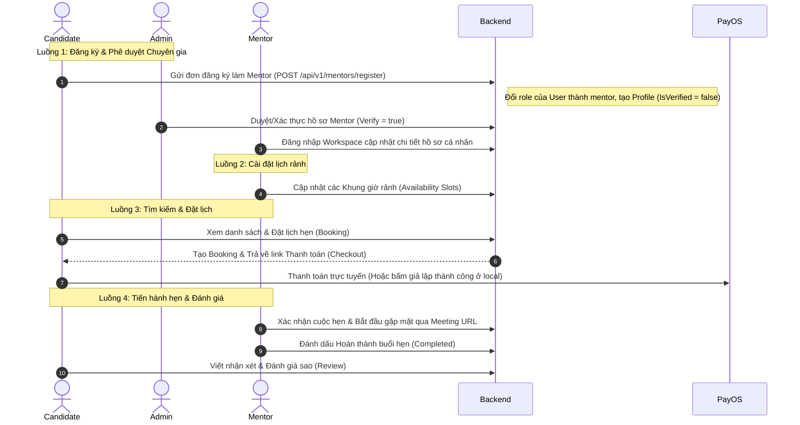

# 📘 HƯỚNG DẪN TÍCH HỢP FRONTEND - LUỒNG NGHIỆP VỤ MENTOR

Tài liệu này tổng hợp toàn bộ **luồng nghiệp vụ (flow)**, hướng dẫn các bước thực hiện và **chi tiết 28 API Endpoints kèm JSON Payload mẫu** phục vụ cho việc tích hợp giao diện (Frontend) luồng Mentor trong hệ thống **INTER-VIET**.

---

## 🗺️ TỔNG QUAN CÁC BƯỚC THỰC HIỆN (FLOW WALKTHROUGH)

Để xây dựng một luồng Mentor hoàn chỉnh, Frontend cần thực hiện phối hợp các API theo 4 luồng chính sau:



---

## 🗂️ CHI TIẾT 28 API ENDPOINTS & PAYLOAD JSON MẪU

---

### Phân hệ 1: 🌐 Dành cho Ứng viên & Khách vãng lai (Public API)
*Không yêu cầu đăng nhập (AllowAnonymous), thích hợp dùng cho trang Landing Page, trang chủ.*

#### 1. Lấy danh sách Mentor công khai đã được Admin duyệt
* **HTTP Method:** `GET`
* **Route:** `/api/v1/public/mentors`
* **Query Params:** 
  * `page` (Mặc định: 1)
  * `pageSize` (Mặc định: 20)
  * `search` (Tìm theo tên, bio, headline)
  * `specialty` (Mã chuyên môn, ví dụ: `dot-net`)
  * `minRating` (Đánh giá sao tối thiểu, ví dụ: `4.5`)
* **Response Body (200 OK):**
```json
{
  "total": 1,
  "page": 1,
  "pageSize": 20,
  "items": [
    {
      "id": "c1a2b3c4-d5e6-4f7a-8b9c-0d1e2f3a4b5c",
      "fullName": "Nguyễn Văn A",
      "headline": "Senior .NET Engineer @ TechCorp",
      "avatarUrl": "https://api.interviet.vn/avatars/mentor-a.jpg",
      "yearsOfExperience": 6.5,
      "ratingAverage": 4.9,
      "ratingCount": 12,
      "specialties": [
        {
          "id": "e1f2g3h4-i5j6-4k7l-8m9n-0o1p2q3r4s5t",
          "code": "dot-net",
          "name": ".NET Core",
          "description": "Lập trình C# Backend"
        }
      ]
    }
  ]
}
```

#### 2. Xem chi tiết hồ sơ công khai của 1 Mentor
* **HTTP Method:** `GET`
* **Route:** `/api/v1/public/mentors/{id:guid}`
* **Response Body (200 OK):**
```json
{
  "id": "c1a2b3c4-d5e6-4f7a-8b9c-0d1e2f3a4b5c",
  "fullName": "Nguyễn Văn A",
  "headline": "Senior .NET Engineer @ TechCorp",
  "avatarUrl": "https://api.interviet.vn/avatars/mentor-a.jpg",
  "bio": "Xin chào, mình có hơn 6 năm kinh nghiệm lập trình C# Backend và thiết kế hệ thống...",
  "yearsOfExperience": 6.5,
  "ratingAverage": 4.9,
  "ratingCount": 12,
  "expertise": ["Backend", "Microservices", "Docker"],
  "industries": ["Fintech", "E-commerce"],
  "languages": ["Tiếng Việt", "English"],
  "specialties": [
    {
      "id": "e1f2g3h4-i5j6-4k7l-8m9n-0o1p2q3r4s5t",
      "code": "dot-net",
      "name": ".NET Core",
      "description": "Lập trình C# Backend"
    }
  ],
  "availabilitySlots": [
    {
      "id": "a1b2c3d4-e5f6-4g7h-8i9j-0k1l2m3n4o5p",
      "startsAt": "2026-06-01T08:00:00Z",
      "endsAt": "2026-06-01T09:00:00Z",
      "status": "available",
      "priceAmount": 200000.0,
      "currencyCode": "VND"
    }
  ]
}
```

#### 3. Lấy riêng danh sách khung giờ rảnh của 1 Mentor
* **HTTP Method:** `GET`
* **Route:** `/api/v1/public/mentors/{id:guid}/availability`
* **Response Body (200 OK):**
```json
[
  {
    "id": "a1b2c3d4-e5f6-4g7h-8i9j-0k1l2m3n4o5p",
    "startsAt": "2026-06-01T08:00:00Z",
    "endsAt": "2026-06-01T09:00:00Z",
    "status": "available",
    "priceAmount": 200000.0,
    "currencyCode": "VND"
  }
]
```

---

### Phân hệ 2: 💼 Dành cho bản thân Chuyên gia (Mentor Workspace API)
*Yêu cầu Token JWT của Mentor: `Headers -> Authorization: Bearer <Token_Mentor>`*

#### 4. Xem thông tin hồ sơ của tôi (Self Profile)
* **HTTP Method:** `GET`
* **Route:** `/api/v1/mentor/profile`
* **Response Body (200 OK):** *(Trả về cấu trúc tương tự API Chi tiết công khai, nhưng kèm thông tin trạng thái duyệt)*
```json
{
  "id": "c1a2b3c4-d5e6-4f7a-8b9c-0d1e2f3a4b5c",
  "userId": "99999999-9999-9999-9999-999999999999",
  "isVerified": true,
  "fullName": "Nguyễn Văn A",
  "headline": "Senior .NET Engineer @ TechCorp",
  "avatarUrl": "https://...",
  "bio": "Hơn 6 năm kinh nghiệm...",
  "yearsOfExperience": 6.5,
  "ratingAverage": 4.9,
  "ratingCount": 12,
  "status": "active",
  "expertise": ["Backend", "Microservices"],
  "industries": ["Fintech"],
  "languages": ["Tiếng Việt"],
  "specialties": []
}
```

#### 5. Tạo mới / Cập nhật hồ sơ chuyên gia của tôi
* **HTTP Method:** `PUT`
* **Route:** `/api/v1/mentor/profile`
* **Request Body (JSON):**
```json
{
  "fullName": "Nguyễn Văn A",
  "headline": "Senior .NET Engineer @ TechCorp",
  "avatarUrl": "https://api.interviet.vn/avatars/mentor-a.jpg",
  "bio": "Xin chào, mình có hơn 6 năm kinh nghiệm lập trình C# Backend...",
  "yearsOfExperience": 6.5,
  "expertise": ["Backend", "Microservices"],
  "industries": ["Fintech", "E-commerce"],
  "languages": ["Tiếng Việt", "English"],
  "meetingUrl": "https://meet.google.com/abc-xyz-123" // Bắt buộc nhập link phòng họp riêng của Mentor
}
```
* **Response Body (200 OK):** Trả về thông tin hồ sơ đã cập nhật.

#### 6. Lấy danh sách danh mục Chuyên môn hệ thống (để hiển thị Selector cho Mentor chọn)
* **HTTP Method:** `GET`
* **Route:** `/api/v1/mentor/specialties`
* **Response Body (200 OK):**
```json
[
  {
    "id": "e1f2g3h4-i5j6-4k7l-8m9n-0o1p2q3r4s5t",
    "code": "dot-net",
    "name": ".NET Core",
    "description": "Lập trình C# Backend"
  }
]
```

#### 7. Gán chuyên môn vào hồ sơ cá nhân
* **HTTP Method:** `POST`
* **Route:** `/api/v1/mentor/profile/specialties`
* **Request Body (JSON):**
```json
{
  "specialtyIds": [
    "e1f2g3h4-i5j6-4k7l-8m9n-0o1p2q3r4s5t"
  ]
}
```
* **Response Body (200 OK):**
```json
{
  "mentorProfileId": "c1a2b3c4-d5e6-4f7a-8b9c-0d1e2f3a4b5c",
  "specialties": [
    {
      "id": "e1f2g3h4-i5j6-4k7l-8m9n-0o1p2q3r4s5t",
      "code": "dot-net",
      "name": ".NET Core"
    }
  ]
}
```

#### 8. Xem thống kê Dashboard của Mentor (Số lượng lịch đặt, doanh thu...)
* **HTTP Method:** `GET`
* **Route:** `/api/v1/mentor/dashboard/summary`
* **Response Body (200 OK):**
```json
{
  "pendingBookingsCount": 1,
  "confirmedBookingsCount": 5,
  "completedBookingsCount": 10,
  "cancelledBookingsCount": 2,
  "totalEarningsAmount": 2000000.0,
  "currencyCode": "VND",
  "averageRating": 4.9,
  "recentBookings": []
}
```

#### 9. Lấy danh sách lịch đặt hẹn của Mentor (Khách đặt lịch với mình)
* **HTTP Method:** `GET`
* **Route:** `/api/v1/mentor/bookings`
* **Query Params:** `status` (Lọc theo trạng thái), `search` (Tìm theo tên ứng viên), `page`, `pageSize`.
* **Response Body (200 OK):**
```json
{
  "total": 1,
  "page": 1,
  "pageSize": 20,
  "items": [
    {
      "id": "b1b2b3b4-b5b6-4b7b-8b8b-9b9b9b9b9b9b",
      "userId": "11111111-1111-1111-1111-111111111111",
      "candidateName": "Ứng viên Nguyễn Văn B",
      "candidateEmail": "candidate.b@gmail.com",
      "candidateAvatarUrl": "https://...",
      "status": "confirmed",
      "scheduledStartsAt": "2026-06-01T08:00:00Z",
      "scheduledEndsAt": "2026-06-01T09:00:00Z",
      "serviceType": "cv_review",
      "amount": 200000.0,
      "currencyCode": "VND",
      "meetingUrl": "https://meet.google.com/abc-xyz-123"
    }
  ]
}
```

#### 10. Xem chi tiết 1 lịch đặt hẹn (dưới góc nhìn Mentor)
* **HTTP Method:** `GET`
* **Route:** `/api/v1/mentor/bookings/{id:guid}`
* **Response Body (200 OK):** Trả về chi tiết bản ghi bao gồm thông tin ứng viên và review nếu có.

#### 11. Cập nhật trạng thái cuộc hẹn (Mentor ấn Xác nhận, Hủy hoặc Hoàn thành)
* **HTTP Method:** `POST`
* **Route:** `/api/v1/mentor/bookings/{id:guid}/status`
* **Request Body (JSON):**
```json
{
  "status": "confirmed", // confirmed | cancelled | completed
  "cancelReason": "Bận lịch đột xuất", // Bắt buộc truyền nếu status = cancelled
  "meetingUrl": "https://meet.google.com/abc-xyz-123" // Bắt buộc truyền và phải là URL hợp lệ nếu status = confirmed
}
```
* **Response Body (200 OK):**
```json
{
  "message": "Cập nhật trạng thái lịch hẹn thành công.",
  "previousStatus": "pending_payment",
  "currentStatus": "confirmed"
}
```

#### 12. Cập nhật Link phòng họp trực tuyến (Meeting URL) của lịch hẹn
* **HTTP Method:** `PATCH`
* **Route:** `/api/v1/mentor/bookings/{id:guid}/meeting-url`
* **Request Body (JSON):**
```json
{
  "meetingUrl": "https://meet.google.com/abc-xyz-123"
}
```
* **Response Body (200 OK):**
```json
{
  "message": "Cập nhật link phòng họp thành công.",
  "meetingUrl": "https://meet.google.com/abc-xyz-123"
}
```

#### 13. Xem danh sách khung giờ rảnh cá nhân đã cấu hình
* **HTTP Method:** `GET`
* **Route:** `/api/v1/mentor/availability`

#### 14. Cài đặt / Cập nhật khung giờ rảnh mới (Thêm lịch rảnh)
* **HTTP Method:** `PUT`
* **Route:** `/api/v1/mentor/availability`
* **Request Body (JSON):**
```json
{
  "slots": [
    {
      "startsAt": "2026-06-01T08:00:00Z",
      "endsAt": "2026-06-01T09:00:00Z",
      "priceAmount": 200000.0,
      "currencyCode": "VND"
    },
    {
      "startsAt": "2026-06-01T09:30:00Z",
      "endsAt": "2026-06-01T10:30:00Z",
      "priceAmount": 200000.0,
      "currencyCode": "VND"
    }
  ]
}
```
* **Response Body (200 OK):**
```json
{
  "clearedCount": 2, // Số khung giờ rảnh cũ chưa có ai đặt đã bị xóa đi
  "addedCount": 2 // Số khung giờ rảnh mới được thêm vào thành công
}
```

---

### Phân hệ 3: 🎓 Dành cho Ứng viên đã đăng nhập (Candidate API)
*Yêu cầu Token JWT của Candidate: `Headers -> Authorization: Bearer <Token_Candidate>`*

#### 15. Đăng ký trở thành Mentor (Mentor Onboarding Application)
* **HTTP Method:** `POST`
* **Route:** `/api/v1/mentors/register`
* **Request Body (JSON):**
```json
{
  "fullName": "Nguyễn Văn A",
  "headline": "Senior .NET Engineer @ TechCorp",
  "bio": "Xin chào, mình có hơn 6 năm kinh nghiệm lập trình C# Backend...",
  "yearsOfExperience": 6.5,
  "expertise": ["Backend", "Microservices"],
  "industries": ["Fintech", "E-commerce"],
  "languages": ["Tiếng Việt", "English"],
  "specialtyIds": [
    "e1f2g3h4-i5j6-4k7l-8m9n-0o1p2q3r4s5t"
  ],
  "meetingUrl": "https://meet.google.com/abc-xyz-123" // Bắt buộc nhập link phòng họp riêng khi đăng ký
}
```
* **Response Body (201 Created):**
```json
{
  "message": "Đăng ký thành công. Vui lòng chờ quản trị viên phê duyệt hồ sơ của bạn.",
  "mentorProfileId": "c1a2b3c4-d5e6-4f7a-8b9c-0d1e2f3a4b5c"
}
```

#### 16. Duyệt danh sách Mentor dành cho Candidate đã đăng nhập (API bảo mật)
* **HTTP Method:** `GET`
* **Route:** `/api/v1/mentors`
* **Query Params:** `specialty`, `serviceType`, `rating`, `search`, `page`, `pageSize`

#### 17. Xem chi tiết Mentor (Yêu cầu đăng nhập)
* **HTTP Method:** `GET`
* **Route:** `/api/v1/mentors/{id:guid}`

#### 18. Xem khung giờ rảnh của Mentor (Yêu cầu đăng nhập)
* **HTTP Method:** `GET`
* **Route:** `/api/v1/mentors/{id:guid}/availability`

#### 19. Gửi yêu cầu đặt lịch hẹn (Book Mentor)
* **HTTP Method:** `POST`
* **Route:** `/api/v1/mentor-bookings`
* **Request Body (JSON):**
```json
{
  "slotId": "a1b2c3d4-e5f6-4g7h-8i9j-0k1l2m3n4o5p",
  "serviceType": "cv_review", // cv_review | mock_interview | career_coaching | technical_mentoring
  "candidateNotes": "Nhờ mentor xem kỹ giúp em phần kinh nghiệm dự án .NET..."
}
```
* **Response Body (200 OK):**
```json
{
  "bookingId": "b1b2b3b4-b5b6-4b7b-8b8b-9b9b9b9b9b9b",
  "status": "pending_payment",
  "amount": 200000.0,
  "currencyCode": "VND",
  "checkoutSessionId": "08be8dfa-8091-46c5-8e57-ac646083e843",
  "checkoutUrl": "https://pay.payos.vn/web/fbaac18082b943b2bf60cfdd89d04dc7", // Redirect Candidate sang trang này để thanh toán
  "paymentInstructionsUrl": "/api/v1/billing/checkout-sessions/08be8dfa-8091-46c5-8e57-ac646083e843/payment-instructions"
}
```

#### 20. Xem danh sách lịch hẹn đã đặt của Candidate
* **HTTP Method:** `GET`
* **Route:** `/api/v1/mentor-bookings`

#### 21. Xem chi tiết lịch hẹn đã đặt
* **HTTP Method:** `GET`
* **Route:** `/api/v1/mentor-bookings/{id:guid}`

#### 22. Candidate chủ động Hủy lịch hẹn
* **HTTP Method:** `POST`
* **Route:** `/api/v1/mentor-bookings/{id:guid}/cancel`
* **Request Body (JSON):**
```json
{
  "reason": "Em có việc bận đột xuất giờ đó."
}
```

#### 23. Candidate gửi đánh giá & viết nhận xét (Sau khi hoàn thành cuộc hẹn)
* **HTTP Method:** `POST`
* **Route:** `/api/v1/mentor-bookings/{id:guid}/review`
* **Request Body (JSON):**
```json
{
  "rating": 5, // 1 đến 5 sao
  "comment": "Mentor chỉ ra các lỗi CV rất chi tiết, hướng đi rõ ràng."
}
```
* **Response Body (200 OK):** Trả về bản ghi nhận xét vừa lưu thành công.

---

### Phân hệ 4: 👑 Dành cho Quản trị viên (Admin API)
*Yêu cầu Token JWT của Admin: `Headers -> Authorization: Bearer <Token_Admin>`*

#### 24. Lấy toàn bộ danh sách Mentor trong hệ thống để duyệt
* **HTTP Method:** `GET`
* **Route:** `/api/v1/mentor/admin/mentors`
* **Query Params:** `search`, `isVerified` (Để true/false để lọc danh sách cần duyệt/đã duyệt).

#### 25. Phê duyệt duyệt / Hủy duyệt hồ sơ chuyên gia
* **HTTP Method:** `POST`
* **Route:** `/api/v1/mentor/admin/mentors/{id:guid}/verify?verify=true`
* **Query Params:** `verify=true` (Duyệt) | `verify=false` (Hủy duyệt).

#### 26. Đóng / Mở hoạt động hồ sơ Mentor
* **HTTP Method:** `POST`
* **Route:** `/api/v1/mentor/admin/mentors/{id:guid}/status?status=active`
* **Query Params:** `status` (`active` | `inactive`).

#### 27. Quản lý xem toàn bộ các Booking trong hệ thống
* **HTTP Method:** `GET`
* **Route:** `/api/v1/admin/mentor-bookings`

#### 28. Thêm mới / Cập nhật chuyên mục hệ thống (CRUD Chuyên Môn)
* **HTTP Method:** `POST` (Tạo mới) | `PUT` (Cập nhật) | `DELETE` (Xóa)
* **Route:** `/api/v1/admin/mentors/specialties` hoặc `/api/v1/admin/mentors/specialties/{id:guid}`

---

## 💡 CÁC LƯU Ý KỸ THUẬT QUAN TRỌNG CHO FRONTEND

1. **Kiểu Dịch vụ (`serviceType`):** Phải thuộc 1 trong 4 từ khóa sau (không viết sai chính tả):
   * `cv_review` (Đánh giá CV)
   * `mock_interview` (Phỏng vấn thử)
   * `career_coaching` (Định hướng nghề nghiệp)
   * `technical_mentoring` (Cố vấn kỹ thuật)
2. **Định dạng thời gian (Datetime):** Tất cả các khung giờ gửi lên hoặc nhận về đều tuân theo chuẩn **ISO 8601** và múi giờ **UTC** (được kết thúc bằng ký tự `Z`, ví dụ: `2026-06-01T08:00:00Z`). Frontend cần chuyển đổi sang múi giờ địa phương (GMT+7) khi hiển thị lên giao diện cho người dùng.
3. **Mã trạng thái cuộc hẹn (`Booking Status`):**
   * `pending_payment` (Đang chờ thanh toán qua cổng PayOS)
   * `confirmed` (Thành công - Đã thanh toán và được xác nhận)
   * `completed` (Buổi hẹn đã kết thúc tốt đẹp)
   * `cancelled` (Lịch hẹn bị hủy bỏ từ phía Mentor hoặc Candidate)
4. **Cơ chế xử lý Email bất đồng bộ (Background Email Sending):**
   Toàn bộ các API gửi email (Đăng ký tài khoản, Đổi mật khẩu, Xác thực lại email, Hóa đơn thanh toán thành công, Xác nhận lịch đặt Mentor thành công) trong Backend C# hiện đã được chuyển giao cho các luồng xử lý chạy ngầm (**Background Tasks - Fire-and-Forget** thông qua `Task.Run`).
   * **Lợi ích:** API sẽ phản hồi thành công `200 OK` hoặc `201 Created` ngay lập tức (**~0.1s**), loại bỏ hoàn toàn hiện tượng treo spinner xoay tròn tải trang do chờ đợi SMTP Server kết nối hoặc gặp lỗi timeout khi Render chặn cổng gửi email outbound (Port 587).
   * **Frontend:** Không cần xử lý chờ đợi gửi email phức tạp, chỉ cần nhận kết quả trả về từ API và hiển thị thông báo thành công cho người dùng ngay lập tức.
