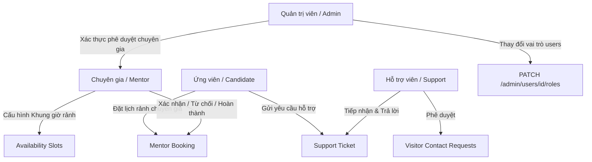

# TÀI LIỆU TÍCH HỢP FRONTEND - PHASE 16
## Phân Tách Vai Trò + Support Workspace + Mentor Workspace

Tài liệu này là cẩm nang tích hợp kỹ thuật chi tiết dành cho lập trình viên Frontend (Web/Mobile) để phát triển các tính năng phân tách vai trò (Role Separation), định tuyến theo quyền (Role-based Routing) và tích hợp các cổng Workspace cho **Support** và **Mentor** khớp nối 100% với mã nguồn Backend INTER-VIET hiện tại.

---

## ━━━━━━━━━━━━━━━━━━━━━━━━━━━━━━━━━━━━━━━━━━━━━━━━━━━━━━━━━━━━━━━━━━━━━━━━━
## 1. Tổng quan Phase 16 & Phân Tách Vai Trò (Role Separation)
## ━━━━━━━━━━━━━━━━━━━━━━━━━━━━━━━━━━━━━━━━━━━━━━━━━━━━━━━━━━━━━━━━━━━━━━━━━

Hệ thống INTER-VIET được thiết kế theo mô hình **Single-Role** nghiêm ngặt tại một thời điểm. Mỗi người dùng chỉ sở hữu một vai trò chính và tương tác với một Workspace độc lập:

1. **Candidate (Ứng viên / User)**: Sử dụng các dịch vụ lõi (Tải CV, phân tích so khớp JD, phỏng vấn thử với AI, đặt lịch tư vấn với chuyên gia).
2. **Support (Nhân viên hỗ trợ)**: Quản lý ticket hỗ trợ của ứng viên và phê duyệt yêu cầu liên hệ từ khách vãng lai.
3. **Mentor (Chuyên gia tư vấn)**: Cấu hình lịch rảnh, tự quản lý bài đăng cá nhân, nhận và xử lý lịch đặt hẹn CV Review / Mock Interview của ứng viên.
4. **Admin (Quản trị hệ thống)**: Toàn quyền truy cập quản trị hệ thống, thay đổi vai trò người dùng, quản trị cổng CMS công cộng, thanh toán hóa đơn và xác thực hồ sơ chuyên gia.

### **Luồng Nghiệp vụ chính:**


---

## ━━━━━━━━━━━━━━━━━━━━━━━━━━━━━━━━━━━━━━━━━━━━━━━━━━━━━━━━━━━━━━━━━━━━━━━━━
## 2. Role-Based Routing (Định tuyến phía Frontend)
## ━━━━━━━━━━━━━━━━━━━━━━━━━━━━━━━━━━━━━━━━━━━━━━━━━━━━━━━━━━━━━━━━━━━━━━━━━

Frontend bắt buộc phải giải mã JWT Token sau khi đăng nhập để trích xuất trường `role` và thực hiện chặn định tuyến, bảo vệ Route nghiêm ngặt:

| Vai trò (`role` code) | Trang được phép truy cập (Allowed Routes) | Trang bị cấm truy cập (Blocked Routes - Chuyển hướng về 403) |
|---|---|---|
| **Candidate / User** | `/dashboard`, `/support` (màn hình gửi ticket ứng viên) | `/support/dashboard`, `/support/workspace/*`, `/mentor/*`, `/admin/*` |
| **Support** | `/support/dashboard`, `/support/workspace/*` | `/mentor/*`, `/admin/*`, `/dashboard` (của Candidate) |
| **Mentor** | `/mentor/dashboard`, `/mentor/bookings`, `/mentor/profile` | `/support/*`, `/admin/*`, `/dashboard` (của Candidate) |
| **Admin** | Toàn quyền truy cập (bao gồm cả Admin CMS, Billing, User Management, logs) | Không bị chặn |

---

## ━━━━━━━━━━━━━━━━━━━━━━━━━━━━━━━━━━━━━━━━━━━━━━━━━━━━━━━━━━━━━━━━━━━━━━━━━
## 3. Support Dashboard APIs
## ━━━━━━━━━━━━━━━━━━━━━━━━━━━━━━━━━━━━━━━━━━━━━━━━━━━━━━━━━━━━━━━━━━━━━━━━━

### **3.1 GET `/api/v1/support/workspace/dashboard/summary`**
* **Mục đích**: Lấy các số liệu thống kê tổng hợp số lượng ticket và liên hệ khách gửi về.
* **Xác thực**: Quyền `Support` hoặc `Admin` (`SupportOrAdmin` Policy).
* **Quy tắc nghiệp vụ**: Tất cả các chỉ số phải đếm thật trực tiếp từ DB.
* **Dữ liệu mẫu thành công (Response JSON)**:
  ```json
  {
    "success": true,
    "message": null,
    "data": {
      "totalTickets": 24,
      "openTickets": 10,
      "inProgressTickets": 8,
      "resolvedTickets": 4,
      "closedTickets": 2,
      "totalContactRequests": 15,
      "pendingContactRequests": 5,
      "processedContactRequests": 10
    },
    "meta": {
      "requestId": "0HMA1S9P20K1H:00000001",
      "timestamp": "2026-05-25T15:30:50Z"
    }
  }
  ```

---

## ━━━━━━━━━━━━━━━━━━━━━━━━━━━━━━━━━━━━━━━━━━━━━━━━━━━━━━━━━━━━━━━━━━━━━━━━━
## 4. Support Workspace APIs (Quản lý Hỗ trợ)
## ━━━━━━━━━━━━━━━━━━━━━━━━━━━━━━━━━━━━━━━━━━━━━━━━━━━━━━━━━━━━━━━━━━━━━━━━━

### **4.1 GET `/api/v1/support/workspace/tickets`**
* **Mục đích**: Lấy danh sách các ticket hỗ trợ trong hệ thống để tiếp nhận và xử lý.
* **Query Parameters**:
  - `status` (string, optional): Lọc trạng thái (`open`, `in_progress`, `resolved`, `closed`).
  - `category` (string, optional): Lọc theo phân loại.
  - `priority` (string, optional): Lọc độ ưu tiên (`low`, `normal`, `high`).
  - `assignedToMe` (bool, optional): Nếu `true` chỉ lọc các ticket được phân công cho chính nhân viên đăng nhập (so khớp qua Email trong JWT Token). Nếu `false`, lọc các ticket chưa được phân công.
  - `search` (string, optional): Tìm kiếm theo Tiêu đề, Mã số ticket, hoặc Mô tả chi tiết.
  - `page` (int, default: 1)
  - `pageSize` (int, default: 20)
* **Response JSON mẫu**:
  ```json
  {
    "success": true,
    "message": null,
    "data": {
      "total": 1,
      "page": 1,
      "pageSize": 20,
      "items": [
        {
          "id": "e5f4d3c2-b1a0-9e8f-7d6c-5b4a3f2e1d0c",
          "ticketNumber": "TK-20260525-487",
          "category": "CV_Matching",
          "priority": "normal",
          "subject": "Lỗi CV Matching không nhận diện tiếng Việt",
          "status": "in_progress",
          "description": "Tôi tải lên CV PDF tiếng Việt nhưng bị lỗi...",
          "assignedTo": "support.staff@interviet.vn",
          "createdAt": "2026-05-25T15:15:32Z",
          "closedAt": null,
          "lastMessageAt": "2026-05-25T15:20:00Z",
          "messages": []
        }
      ]
    },
    "meta": {
      "requestId": "0HMA1S9P20K1H:00000002",
      "timestamp": "2026-05-25T15:32:00Z"
    }
  }
  ```

---

### **4.2 GET `/api/v1/support/workspace/tickets/{id}`**
* **Mục đích**: Lấy thông tin chi tiết ticket cùng toàn bộ lịch sử trò chuyện (bao gồm cả các ghi chú nội bộ).
* **Response JSON mẫu**:
  ```json
  {
    "success": true,
    "message": null,
    "data": {
      "id": "e5f4d3c2-b1a0-9e8f-7d6c-5b4a3f2e1d0c",
      "ticketNumber": "TK-20260525-487",
      "category": "CV_Matching",
      "priority": "normal",
      "subject": "Lỗi CV Matching không nhận diện tiếng Việt",
      "status": "in_progress",
      "description": "Tôi tải lên CV PDF tiếng Việt nhưng bị lỗi...",
      "assignedTo": "support.staff@interviet.vn",
      "createdAt": "2026-05-25T15:15:32Z",
      "closedAt": null,
      "lastMessageAt": "2026-05-25T15:20:00Z",
      "messages": [
        {
          "id": "m1m1m1m1-e5f6-7a8b-9c0d-1e2f3a4b5c6d",
          "senderType": "candidate",
          "senderUserId": "a9b8c7d6-e5f4-3a2b-1c0d-9e8f7a6b5c4d",
          "messageBody": "Vui lòng xem lại ảnh đính kèm lỗi...",
          "createdAt": "2026-05-25T15:16:00Z",
          "isInternalNote": false
        },
        {
          "id": "m2m2m2m2-e5f6-7a8b-9c0d-1e2f3a4b5c6d",
          "senderType": "support",
          "senderUserId": "c1f1a1d1-e5f6-7a8b-9c0d-1e2f3a4b5c6d",
          "messageBody": "Đang kiểm tra logs chuyển đổi CV trên môi trường test.",
          "createdAt": "2026-05-25T15:18:00Z",
          "isInternalNote": true
        }
      ]
    },
    "meta": {
      "requestId": "0HMA1S9P20K1H:00000003",
      "timestamp": "2026-05-25T15:32:10Z"
    }
  }
  ```

---

### **4.3 POST `/api/v1/support/workspace/tickets/{id}/assign-self`**
* **Mục đích**: Nhân viên tự nhận ticket này để xử lý (Gán cột `AssignedTo` thành Email của mình và cập nhật trạng thái sang `"in_progress"`).
* **Response JSON mẫu**:
  ```json
  {
    "success": true,
    "message": null,
    "data": {
      "ticketId": "e5f4d3c2-b1a0-9e8f-7d6c-5b4a3f2e1d0c",
      "ticketNumber": "TK-20260525-487",
      "assignedTo": "support.staff@interviet.vn",
      "status": "in_progress"
    },
    "meta": {
      "requestId": "0HMA1S9P20K1H:00000004",
      "timestamp": "2026-05-25T15:33:00Z"
    }
  }
  ```

---

### **4.4 POST `/api/v1/support/workspace/tickets/{id}/messages`**
* **Mục đích**: Trả lời ứng viên hoặc viết ghi chú nội bộ dành riêng cho đội hỗ trợ.
* **Request Body (JSON)**:
  ```json
  {
    "messageBody": "Chào bạn, lỗi hiển thị font đã được bộ phận kỹ thuật khắc phục. Bạn vui lòng thử tải lại CV nhé.",
    "isInternalNote": false
  }
  ```
  *(Đặt `isInternalNote = true` nếu chỉ muốn viết ghi chú nội bộ, ghi chú này sẽ bị ẩn hoàn toàn khỏi màn hình Dashboard của ứng viên)*
* **Response JSON mẫu**:
  ```json
  {
    "success": true,
    "message": "Message added successfully.",
    "data": {
      "id": "m3m3m3m3-e5f6-7a8b-9c0d-1e2f3a4b5c6d",
      "senderType": "support",
      "senderUserId": "c1f1a1d1-e5f6-7a8b-9c0d-1e2f3a4b5c6d",
      "messageBody": "Chào bạn, lỗi hiển thị font đã được bộ phận kỹ thuật khắc phục. Bạn vui lòng thử tải lại CV nhé.",
      "createdAt": "2026-05-25T15:35:00Z",
      "isInternalNote": false
    },
    "meta": {
      "requestId": "0HMA1S9P20K1H:00000005",
      "timestamp": "2026-05-25T15:35:00Z"
    }
  }
  ```

---

### **4.5 POST `/api/v1/support/workspace/tickets/{id}/status`**
* **Mục đích**: Thay đổi trạng thái ticket hỗ trợ theo tiến trình thực tế.
* **Request Body (JSON)**:
  ```json
  {
    "status": "resolved"
  }
  ```
  *(Các trạng thái cho phép: `"open"`, `"in_progress"`, `"resolved"`, `"closed"`)*
* **Response JSON mẫu**:
  ```json
  {
    "success": true,
    "message": "Ticket status overridden successfully.",
    "data": {
      "previousStatus": "in_progress",
      "currentStatus": "resolved"
    },
    "meta": {
      "requestId": "0HMA1S9P20K1H:00000006",
      "timestamp": "2026-05-25T15:36:00Z"
    }
  }
  ```

---

## ━━━━━━━━━━━━━━━━━━━━━━━━━━━━━━━━━━━━━━━━━━━━━━━━━━━━━━━━━━━━━━━━━━━━━━━━━
## 5. Contact Request Workspace (Support)
## ━━━━━━━━━━━━━━━━━━━━━━━━━━━━━━━━━━━━━━━━━━━━━━━━━━━━━━━━━━━━━━━━━━━━━━━━━

### **5.1 GET `/api/v1/support/workspace/contact-requests`**
* **Mục đích**: Danh sách liên hệ của khách hàng chưa đăng nhập.
* **Response JSON mẫu**:
  ```json
  {
    "success": true,
    "message": null,
    "data": {
      "total": 1,
      "page": 1,
      "pageSize": 10,
      "items": [
        {
          "id": "a9b8c7d6-e5f4-3a2b-1c0d-9e8f7a6b5c4d",
          "fullName": "Nguyễn Hoàng Nam",
          "email": "nam.guest@gmail.com",
          "phone": "0912345678",
          "subject": "Yêu cầu hợp tác doanh nghiệp",
          "category": "Partnership",
          "message": "Tôi muốn liên hệ hợp tác...",
          "status": "pending",
          "createdAt": "2026-05-25T15:32:00Z"
        }
      ]
    },
    "meta": {
      "requestId": "0HMA1S9P20K1H:00000007",
      "timestamp": "2026-05-25T15:37:00Z"
    }
  }
  ```

---

### **5.2 GET `/api/v1/support/workspace/contact-requests/{id}`**
* **Mục đích**: Xem chi tiết tin nhắn khách vãng lai gửi.
* **Response JSON mẫu**:
  ```json
  {
    "success": true,
    "message": null,
    "data": {
      "id": "a9b8c7d6-e5f4-3a2b-1c0d-9e8f7a6b5c4d",
      "fullName": "Nguyễn Hoàng Nam",
      "email": "nam.guest@gmail.com",
      "phone": "0912345678",
      "subject": "Yêu cầu hợp tác doanh nghiệp",
      "category": "Partnership",
      "message": "Tôi muốn liên hệ hợp tác để liên kết tuyển dụng hàng loạt tại trung tâm...",
      "status": "pending",
      "createdAt": "2026-05-25T15:32:00Z"
    },
    "meta": {
      "requestId": "0HMA1S9P20K1H:00000008",
      "timestamp": "2026-05-25T15:37:10Z"
    }
  }
  ```

---

### **5.3 POST `/api/v1/support/workspace/contact-requests/{id}/status`**
* **Mục đích**: Đánh dấu liên hệ đã tiếp nhận hoặc bỏ qua.
* **Request Body (JSON)**:
  ```json
  {
    "status": "processed"
  }
  ```
  *(Các trạng thái hợp lệ: `"pending"`, `"processed"`, `"ignored"`)*
* **Response JSON mẫu**:
  ```json
  {
    "success": true,
    "message": "Cập nhật trạng thái yêu cầu liên hệ thành công.",
    "data": {
      "id": "a9b8c7d6-e5f4-3a2b-1c0d-9e8f7a6b5c4d",
      "previousStatus": "pending",
      "currentStatus": "processed"
    },
    "meta": {
      "requestId": "0HMA1S9P20K1H:00000009",
      "timestamp": "2026-05-25T15:37:20Z"
    }
  }
  ```

---

## ━━━━━━━━━━━━━━━━━━━━━━━━━━━━━━━━━━━━━━━━━━━━━━━━━━━━━━━━━━━━━━━━━━━━━━━━━
## 6. Mentor Dashboard APIs
## ━━━━━━━━━━━━━━━━━━━━━━━━━━━━━━━━━━━━━━━━━━━━━━━━━━━━━━━━━━━━━━━━━━━━━━━━━

### **6.1 GET `/api/v1/mentor/dashboard/summary`**
* **Mục đích**: Số liệu tổng hợp hiệu suất nhận đặt lịch, đánh giá và tổng thu nhập của riêng chuyên gia đó.
* **Xác thực**: Quyền `Mentor` hoặc `Admin` (`MentorOrAdmin` Policy).
* **Response JSON mẫu**:
  ```json
  {
    "success": true,
    "message": null,
    "data": {
      "pendingBookingsCount": 3,
      "confirmedBookingsCount": 8,
      "completedBookingsCount": 12,
      "cancelledBookingsCount": 2,
      "totalEarningsAmount": 3600000,
      "currencyCode": "VND",
      "averageRating": 4.8,
      "recentBookings": [
        {
          "id": "b1b1b1b1-e5f6-7a8b-9c0d-1e2f3a4b5c6d",
          "userId": "a9b8c7d6-e5f4-3a2b-1c0d-9e8f7a6b5c4d",
          "mentorId": "m1f1a1d1-e5f6-7a8b-9c0d-1e2f3a4b5c6d",
          "mentorName": "Chuyên Gia Mentor Google",
          "mentorHeadline": "Senior Software Architect @ Google",
          "mentorAvatarUrl": "https://i.pravatar.cc/150",
          "availabilitySlotId": "s1s1s1s1-e5f6-7a8b-9c0d-1e2f3a4b5c6d",
          "status": "completed",
          "scheduledStartsAt": "2026-05-20T09:00:00Z",
          "scheduledEndsAt": "2026-05-20T10:00:00Z",
          "serviceType": "cv_review",
          "amount": 300000,
          "currencyCode": "VND",
          "meetingUrl": "https://meet.interviet.vn/b1b1b1b1/join",
          "candidateNotes": "Xem giúp em CV ứng tuyển vị trí Backend",
          "cancelReason": null,
          "cancelledAt": null,
          "completedAt": "2026-05-20T10:00:00Z",
          "createdAt": "2026-05-18T10:00:00Z",
          "updatedAt": "2026-05-20T10:00:00Z"
        }
      ]
    },
    "meta": {
      "requestId": "0HMA1S9P20K1H:00000010",
      "timestamp": "2026-05-25T15:38:00Z"
    }
  }
  ```

---

## ━━━━━━━━━━━━━━━━━━━━━━━━━━━━━━━━━━━━━━━━━━━━━━━━━━━━━━━━━━━━━━━━━━━━━━━━━
## 7. Mentor Profile APIs (Hồ sơ Chuyên gia)
## ━━━━━━━━━━━━━━━━━━━━━━━━━━━━━━━━━━━━━━━━━━━━━━━━━━━━━━━━━━━━━━━━━━━━━━━━━

### **7.1 GET `/api/v1/mentor/profile`**
* **Mục đích**: Lấy thông tin hồ sơ của chuyên gia.
* **Frictionless Auto-creation**: Nếu chuyên gia vừa đăng nhập lần đầu và DB chưa có dòng hồ sơ, **API này sẽ tự động khởi tạo hồ sơ rỗng**, kéo `FullName` và `AvatarUrl` từ tài khoản gốc và lưu vào bảng hồ sơ chuyên gia trước khi trả về dữ liệu.
* **Response JSON mẫu**:
  ```json
  {
    "success": true,
    "message": null,
    "data": {
      "id": "m1f1a1d1-e5f6-7a8b-9c0d-1e2f3a4b5c6d",
      "userId": "a9b8c7d6-e5f4-3a2b-1c0d-9e8f7a6b5c4d",
      "isVerified": false,
      "fullName": "Chuyên Gia Mentor Google",
      "headline": "Senior Software Architect @ Google",
      "avatarUrl": "https://i.pravatar.cc/150",
      "bio": "Hơn 10 năm nghiên cứu phân tích hệ thống...",
      "yearsOfExperience": 10.5,
      "ratingAverage": 5.0,
      "ratingCount": 0,
      "status": "active",
      "expertise": ["C#", "System Design", "Kubernetes"],
      "industries": ["IT", "e-Commerce"],
      "languages": ["Vietnamese", "English"]
    },
    "meta": {
      "requestId": "0HMA1S9P20K1H:00000011",
      "timestamp": "2026-05-25T15:39:00Z"
    }
  }
  ```

---

### **7.2 PUT `/api/v1/mentor/profile`**
* **Mục đích**: Chuyên gia cập nhật thông tin giới thiệu và các mảng kỹ năng.
* **Request Body (JSON)**:
  ```json
  {
    "fullName": "Nguyễn Hữu Huy",
    "headline": "Tech Lead @ Google Vietnam",
    "avatarUrl": "https://i.pravatar.cc/150",
    "bio": "Tôi sẽ hỗ trợ bạn xây dựng lộ trình sự nghiệp vững chắc...",
    "yearsOfExperience": 12.0,
    "expertise": ["C#", ".NET Core", "System Design", "Cloud Architecture"],
    "industries": ["IT", "Finance"],
    "languages": ["Vietnamese", "English"]
  }
  ```
* **Response JSON mẫu**:
  ```json
  {
    "success": true,
    "message": "Cập nhật hồ sơ Mentor thành công.",
    "data": {
      "id": "m1f1a1d1-e5f6-7a8b-9c0d-1e2f3a4b5c6d",
      "userId": "a9b8c7d6-e5f4-3a2b-1c0d-9e8f7a6b5c4d",
      "isVerified": false,
      "fullName": "Nguyễn Hữu Huy",
      "headline": "Tech Lead @ Google Vietnam",
      "avatarUrl": "https://i.pravatar.cc/150",
      "bio": "Tôi sẽ hỗ trợ bạn xây dựng lộ trình sự nghiệp vững chắc...",
      "yearsOfExperience": 12.0,
      "ratingAverage": 5.0,
      "ratingCount": 0,
      "status": "active",
      "expertise": ["C#", ".NET Core", "System Design", "Cloud Architecture"],
      "industries": ["IT", "Finance"],
      "languages": ["Vietnamese", "English"]
    },
    "meta": {
      "requestId": "0HMA1S9P20K1H:00000012",
      "timestamp": "2026-05-25T15:39:30Z"
    }
  }
  ```

---

## ━━━━━━━━━━━━━━━━━━━━━━━━━━━━━━━━━━━━━━━━━━━━━━━━━━━━━━━━━━━━━━━━━━━━━━━━━
## 8. Mentor Booking Workspace
## ━━━━━━━━━━━━━━━━━━━━━━━━━━━━━━━━━━━━━━━━━━━━━━━━━━━━━━━━━━━━━━━━━━━━━━━━━

### **8.1 GET `/api/v1/mentor/bookings`**
* **Mục đích**: Xem các lịch hẹn do ứng viên đặt lịch với mình (Chuyên gia tuyệt đối không nhìn thấy lịch hẹn của các chuyên gia khác - Bảo vệ quyền riêng tư).
* **Query Parameters**:
  - `status` (string, optional): Lọc trạng thái (`pending_payment`, `confirmed`, `completed`, `cancelled`).
  - `search` (string, optional): Tìm kiếm theo Tên hoặc Email của ứng viên.
  - `page` (int, default: 1)
  - `pageSize` (int, default: 20)
* **Response JSON mẫu**:
  ```json
  {
    "success": true,
    "message": null,
    "data": {
      "total": 1,
      "page": 1,
      "pageSize": 20,
      "items": [
        {
          "id": "b1b1b1b1-e5f6-7a8b-9c0d-1e2f3a4b5c6d",
          "userId": "a9b8c7d6-e5f4-3a2b-1c0d-9e8f7a6b5c4d",
          "candidateName": "Nguyễn Văn Ứng Viên",
          "candidateEmail": "candidate.test@gmail.com",
          "candidateAvatarUrl": "https://i.pravatar.cc/150",
          "mentorId": "m1f1a1d1-e5f6-7a8b-9c0d-1e2f3a4b5c6d",
          "status": "confirmed",
          "scheduledStartsAt": "2026-06-01T09:00:00Z",
          "scheduledEndsAt": "2026-06-01T10:00:00Z",
          "serviceType": "cv_review",
          "amount": 300000,
          "currencyCode": "VND",
          "meetingUrl": "https://meet.interviet.vn/b1b1b1b1/join",
          "candidateNotes": "Cần mentor góp ý chi tiết phần Project trong CV",
          "cancelReason": null,
          "cancelledAt": null,
          "completedAt": null,
          "createdAt": "2026-05-25T14:00:00Z",
          "review": null
        }
      ]
    },
    "meta": {
      "requestId": "0HMA1S9P20K1H:00000013",
      "timestamp": "2026-05-25T15:40:00Z"
    }
  }
  ```

---

### **8.2 GET `/api/v1/mentor/bookings/{id}`**
* **Mục đích**: Xem chi tiết thông tin ứng viên và lịch họp của một lịch hẹn cụ thể.
* **Response JSON mẫu**:
  ```json
  {
    "success": true,
    "message": null,
    "data": {
      "id": "b1b1b1b1-e5f6-7a8b-9c0d-1e2f3a4b5c6d",
      "userId": "a9b8c7d6-e5f4-3a2b-1c0d-9e8f7a6b5c4d",
      "candidateName": "Nguyễn Văn Ứng Viên",
      "candidateEmail": "candidate.test@gmail.com",
      "candidateAvatarUrl": "https://i.pravatar.cc/150",
      "mentorId": "m1f1a1d1-e5f6-7a8b-9c0d-1e2f3a4b5c6d",
      "status": "confirmed",
      "scheduledStartsAt": "2026-06-01T09:00:00Z",
      "scheduledEndsAt": "2026-06-01T10:00:00Z",
      "serviceType": "cv_review",
      "amount": 300000,
      "currencyCode": "VND",
      "meetingUrl": "https://meet.interviet.vn/b1b1b1b1/join",
      "candidateNotes": "Cần mentor góp ý chi tiết phần Project trong CV",
      "cancelReason": null,
      "cancelledAt": null,
      "completedAt": null,
      "createdAt": "2026-05-25T14:00:00Z",
      "review": null
    },
    "meta": {
      "requestId": "0HMA1S9P20K1H:00000014",
      "timestamp": "2026-05-25T15:40:10Z"
    }
  }
  ```

---

### **8.3 POST `/api/v1/mentor/bookings/{id}/status`**
* **Mục đích**: Thay đổi trạng thái lịch hẹn.
* **Quy tắc Nghiệp vụ**:
  - Khi Mentor hủy lịch hẹn (`cancelled`), **bắt buộc phải điền trường `cancelReason`**. Đồng thời, khung giờ rảnh (AvailabilitySlot) sẽ được tự động giải phóng về trạng thái `"available"` để ứng viên khác có thể chọn đặt lại. Các phiên checkout thanh toán đang treo cũng được hủy tự động để tránh mất tiền oan.
  - Khi hoàn thành lịch hẹn (`completed`), chỉ cho phép thay đổi đối với lịch đang có trạng thái `"confirmed"`.
* **Request Body khi Hủy Lịch Hẹn**:
  ```json
  {
    "status": "cancelled",
    "cancelReason": "Trùng lịch công tác đột xuất của Tech Lead tại Google."
  }
  ```
* **Request Body khi Chấp Nhận / Hoàn thành**:
  ```json
  {
    "status": "completed"
  }
  ```
* **Response JSON mẫu**:
  ```json
  {
    "success": true,
    "message": "Cập nhật trạng thái lịch hẹn thành công.",
    "data": {
      "previousStatus": "confirmed",
      "currentStatus": "completed"
    },
    "meta": {
      "requestId": "0HMA1S9P20K1H:00000015",
      "timestamp": "2026-05-25T15:41:00Z"
    }
  }
  ```

---

## ━━━━━━━━━━━━━━━━━━━━━━━━━━━━━━━━━━━━━━━━━━━━━━━━━━━━━━━━━━━━━━━━━━━━━━━━━
## 9. Mentor Availability (Cấu hình khung giờ trống)
## ━━━━━━━━━━━━━━━━━━━━━━━━━━━━━━━━━━━━━━━━━━━━━━━━━━━━━━━━━━━━━━━━━━━━━━━━━

### **9.1 GET `/api/v1/mentor/availability`**
* **Mục đích**: Lấy danh sách toàn bộ các khung giờ trống đã thiết lập của chuyên gia.
* **Response JSON mẫu**:
  ```json
  {
    "success": true,
    "message": null,
    "data": [
      {
        "id": "s1s1s1s1-e5f6-7a8b-9c0d-1e2f3a4b5c6d",
        "startsAt": "2026-06-01T09:00:00Z",
        "endsAt": "2026-06-01T10:00:00Z",
        "status": "available",
        "priceAmount": 300000,
        "currencyCode": "VND"
      }
    ],
    "meta": {
      "requestId": "0HMA1S9P20K1H:00000016",
      "timestamp": "2026-05-25T15:42:00Z"
    }
  }
  ```

---

### **9.2 PUT `/api/v1/mentor/availability`**
* **Mục đích**: Ghi đè lịch rảnh mới.
* **Ràng buộc nghiệp vụ**: Để tránh ảnh hưởng các lịch đặt đã được thanh toán, API sẽ **chỉ xóa các khung giờ trống trong tương lai đang ở trạng thái rảnh (`available`)**. Các giờ đã được ứng viên đặt (`booked`/`reserved`) sẽ được giữ nguyên an toàn.
* **Request Body (JSON)**:
  ```json
  {
    "slots": [
      {
        "startsAt": "2026-06-01T14:00:00Z",
        "endsAt": "2026-06-01T15:00:00Z",
        "priceAmount": 300000,
        "currencyCode": "VND"
      },
      {
        "startsAt": "2026-06-02T09:00:00Z",
        "endsAt": "2026-06-02T10:00:00Z",
        "priceAmount": 300000,
        "currencyCode": "VND"
      }
    ]
  }
  ```
* **Response JSON mẫu**:
  ```json
  {
    "success": true,
    "message": "Cấu hình khung giờ trống thành công.",
    "data": {
      "clearedCount": 1,
      "addedCount": 2
    },
    "meta": {
      "requestId": "0HMA1S9P20K1H:00000017",
      "timestamp": "2026-05-25T15:42:30Z"
    }
  }
  ```

---

## ━━━━━━━━━━━━━━━━━━━━━━━━━━━━━━━━━━━━━━━━━━━━━━━━━━━━━━━━━━━━━━━━━━━━━━━━━
## 10. Public Mentor Directory (Tìm kiếm Chuyên gia)
## ━━━━━━━━━━━━━━━━━━━━━━━━━━━━━━━━━━━━━━━━━━━━━━━━━━━━━━━━━━━━━━━━━━━━━━━━━

*Tất cả API dưới đây đều AllowAnonymous phục vụ các trang tìm kiếm công cộng.*

### **10.1 GET `/api/v1/public/mentors`**
* **Mục đích**: Trang danh sách chuyên gia công khai.
* **Ràng buộc bảo mật**: **Chỉ hiển thị các hồ sơ thỏa mãn: `Status == "active"` AND `IsVerified == true` AND `UserId != null`**. Tuyệt đối không trả về `Email` cá nhân, `UserId` hay các trường thông tin nhạy cảm để tránh lộ thông tin.
* **Response JSON mẫu**:
  ```json
  {
    "success": true,
    "message": null,
    "data": {
      "total": 1,
      "page": 1,
      "pageSize": 20,
      "items": [
        {
          "id": "m1f1a1d1-e5f6-7a8b-9c0d-1e2f3a4b5c6d",
          "fullName": "Nguyễn Hữu Huy",
          "headline": "Tech Lead @ Google Vietnam",
          "avatarUrl": "https://i.pravatar.cc/150",
          "yearsOfExperience": 12.0,
          "ratingAverage": 5.0,
          "ratingCount": 8,
          "specialties": [
            {
              "id": "sp1sp1sp-e5f6-7a8b-9c0d-1e2f3a4b5c6d",
              "code": "it",
              "name": "Công nghệ thông tin",
              "description": "Lập trình & thiết kế hệ thống"
            }
          ]
        }
      ]
    },
    "meta": {
      "requestId": "0HMA1S9P20K1H:00000018",
      "timestamp": "2026-05-25T15:43:00Z"
    }
  }
  ```

---

### **10.2 GET `/api/v1/public/mentors/{id}`**
* **Mục đích**: Trang chi tiết công khai của chuyên gia bao gồm các mảng kỹ năng và lịch trống.
* **Response JSON mẫu**:
  ```json
  {
    "success": true,
    "message": null,
    "data": {
      "id": "m1f1a1d1-e5f6-7a8b-9c0d-1e2f3a4b5c6d",
      "fullName": "Nguyễn Hữu Huy",
      "headline": "Tech Lead @ Google Vietnam",
      "avatarUrl": "https://i.pravatar.cc/150",
      "bio": "Tôi sẽ hỗ trợ bạn xây dựng lộ trình sự nghiệp vững chắc...",
      "yearsOfExperience": 12.0,
      "ratingAverage": 5.0,
      "ratingCount": 8,
      "specialties": [
        {
          "id": "sp1sp1sp-e5f6-7a8b-9c0d-1e2f3a4b5c6d",
          "code": "it",
          "name": "Công nghệ thông tin",
          "description": "Lập trình & thiết kế hệ thống"
        }
      ],
      "availabilitySlots": [
        {
          "id": "s2s2s2s2-e5f6-7a8b-9c0d-1e2f3a4b5c6d",
          "startsAt": "2026-06-01T14:00:00Z",
          "endsAt": "2026-06-01T15:00:00Z",
          "status": "available",
          "priceAmount": 300000,
          "currencyCode": "VND"
        }
      ],
      "expertise": ["C#", ".NET Core", "System Design"],
      "industries": ["IT", "Finance"],
      "languages": ["Vietnamese", "English"]
    },
    "meta": {
      "requestId": "0HMA1S9P20K1H:00000019",
      "timestamp": "2026-05-25T15:43:10Z"
    }
  }
  ```

---

## ━━━━━━━━━━━━━━━━━━━━━━━━━━━━━━━━━━━━━━━━━━━━━━━━━━━━━━━━━━━━━━━━━━━━━━━━━
## 11. Role / Permission Authorization Matrix
## ━━━━━━━━━━━━━━━━━━━━━━━━━━━━━━━━━━━━━━━━━━━━━━━━━━━━━━━━━━━━━━━━━━━━━━━━━

Frontend cần hiểu rõ các API bảo mật để tránh nhận mã lỗi **`403 Forbidden`** từ Gateway:

| Nhóm API | Điểm cuối (URL Prefix) | Ứng viên / Candidate | Nhân viên hỗ trợ / Support | Chuyên gia / Mentor | Quản trị viên / Admin |
|---|---|---|---|---|---|
| **Public Info** | `/api/v1/public/*` | ✅ Cho phép | ✅ Cho phép | ✅ Cho phép | ✅ Cho phép |
| **Candidate** | `/api/v1/support/tickets` (gửi) | ✅ Cho phép | ❌ Chặn (`403`) | ❌ Chặn (`403`) | ✅ Cho phép |
| **Support Workspace** | `/api/v1/support/workspace/*` | ❌ Chặn (`403`) | ✅ Cho phép | ❌ Chặn (`403`) | ✅ Cho phép |
| **Mentor Workspace** | `/api/v1/mentor/*` | ❌ Chặn (`403`) | ❌ Chặn (`403`) | ✅ Cho phép | ✅ Cho phép |
| **Admin Operations** | `/api/v1/admin/*` | ❌ Chặn (`403`) | ❌ Chặn (`403`) | ❌ Chặn (`403`) | ✅ Cho phép |

---

## ━━━━━━━━━━━━━━━━━━━━━━━━━━━━━━━━━━━━━━━━━━━━━━━━━━━━━━━━━━━━━━━━━━━━━━━━━
## 12. Error Handling & Empty States
## ━━━━━━━━━━━━━━━━━━━━━━━━━━━━━━━━━━━━━━━━━━━━━━━━━━━━━━━━━━━━━━━━━━━━━━━━━

### **12.1 Lỗi 403 Forbidden (Khi gọi sai Workspace)**
```json
{
  "success": false,
  "message": "Bạn không có quyền truy cập vào khu vực làm việc này.",
  "meta": {
    "requestId": "0HMA1S9P20K1H:00000256",
    "timestamp": "2026-05-25T15:44:00Z"
  }
}
```

### **12.2 Kịch bản Thiết kế giao diện Trống (Empty States)**
* **Support Dashboard Trống**:
  - Không có ticket: Hiển thị hình vẽ minh họa cái hộp rỗng kèm thông báo *"Hôm nay thật tuyệt! Không có ticket nào đang chờ xử lý."*
  - Không có yêu cầu liên hệ: Hiển thị nhãn *"Toàn bộ yêu cầu liên hệ từ khách đã được xử lý xong."*
* **Mentor Dashboard Trống**:
  - Hiển thị thông báo *"Chưa nhận được lịch đặt hẹn mới. Hãy cập nhật khung giờ rảnh để ứng viên dễ tiếp cận bạn hơn nhé."* kèm nút CTA dẫn nhanh sang màn hình **Cập nhật Lịch Availability**.

---

## ━━━━━━━━━━━━━━━━━━━━━━━━━━━━━━━━━━━━━━━━━━━━━━━━━━━━━━━━━━━━━━━━━━━━━━━━━
## 13. Hệ thống Hành động Nhật ký Hệ thống (Audit Action Keys)
## ━━━━━━━━━━━━━━━━━━━━━━━━━━━━━━━━━━━━━━━━━━━━━━━━━━━━━━━━━━━━━━━━━━━━━━━━━

Tất cả các thay đổi nghiệp vụ quan trọng đều ghi nhận vào bảng `AuditLogs` của hệ thống để quản trị bảo mật:

* **`role_updated`**: Admin thay đổi quyền hạn của tài khoản.
* **`support.ticket_assigned_self`**: Support tự nhận xử lý ticket.
* **`support.ticket_status_updated`**: Thay đổi trạng thái ticket hỗ trợ.
* **`support.ticket_replied`**: Support gửi câu trả lời hoặc viết ghi chú nội bộ.
* **`public.contact_request_status_updated`**: Support/Admin tiếp nhận hoặc bỏ qua yêu cầu liên hệ công cộng.
* **`mentor.profile_autocreated`**: Tự sinh hồ sơ rỗng cho chuyên gia khi đăng nhập lần đầu.
* **`mentor.profile_updated`**: Chuyên gia sửa đổi thông tin giới thiệu.
* **`mentor.booking_cancelled_by_mentor`**: Chuyên gia hủy lịch hẹn (giải phóng AvailabilitySlot).
* **`mentor.booking_confirmed_by_mentor`**: Chuyên gia đồng ý xác nhận lịch hẹn.
* **`mentor.booking_completed_by_mentor`**: Đánh dấu lịch hẹn kết thúc thành công.
* **`mentor.availability_configured`**: Thay đổi cấu hình khung giờ rảnh.

---

## ━━━━━━━━━━━━━━━━━━━━━━━━━━━━━━━━━━━━━━━━━━━━━━━━━━━━━━━━━━━━━━━━━━━━━━━━━
## 14. Swagger Test Checklist dành cho Đội ngũ dự án
## ━━━━━━━━━━━━━━━━━━━━━━━━━━━━━━━━━━━━━━━━━━━━━━━━━━━━━━━━━━━━━━━━━━━━━━━━━

- [ ] **Test Phân Quyền**: Dùng Token Candidate gọi thử `/api/v1/support/workspace/dashboard/summary`. Đảm bảo nhận về lỗi `403 Forbidden`.
- [ ] **Test Gán Single-role**: Dùng Token Admin gọi `PATCH /api/v1/admin/users/{userId}/roles` truyền `["mentor", "support"]`. Xác nhận lỗi `400` và chỉ chấp nhận gán mảng 1 phần tử.
- [ ] **Test Tự động tạo hồ sơ**: Đăng nhập Mentor mới tinh, gọi `GET /api/v1/mentor/profile`. Xác nhận hồ sơ rỗng được tự động thêm vào database mượt mà.
- [ ] **Test Cấu hình Lịch rảnh**: Đăng nhập Mentor, gọi `PUT /api/v1/mentor/availability` ghi đè lịch trống. Kiểm tra DB xem các slot rảnh cũ được dọn và slot bận được giữ lại an toàn.
- [ ] **Test Xem lịch hẹn riêng tư**: Đăng nhập Mentor A, gọi `/api/v1/mentor/bookings`. Thử xem chi tiết booking của Mentor B, đảm bảo không thể xem và nhận về lỗi `404/403`.
