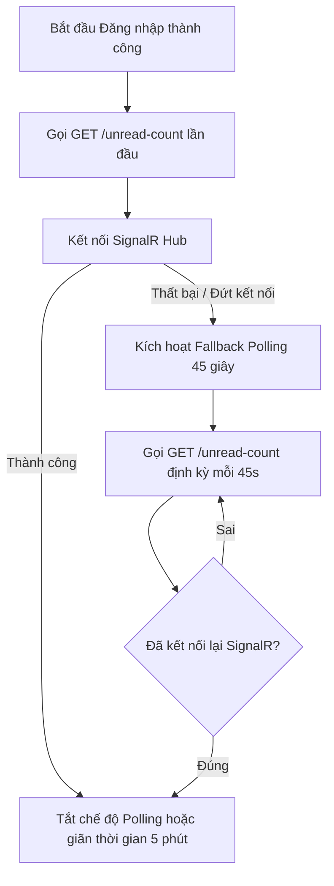

# Tài liệu Tích hợp Frontend — Phase 17: Gaps & Realtime Notifications

Chào mừng đội ngũ Frontend đến với tài liệu hướng dẫn tích hợp **Phase 17 — Frontend Backend Gaps & Realtime Notifications**. Tài liệu này mô tả chi tiết toàn bộ các điểm kết nối API, cấu trúc dữ liệu JSON thực tế từ mã nguồn backend, mô hình bảo mật, cơ chế kết nối thời gian thực qua SignalR và giải pháp dự phòng (fallback polling).

---

## ━━━━━━━━━━━━━━━━━━━━━━━━━━━━━━━━━━━━━━━━━━━━━━━━━━━━━━━━━━━━━━━━━━━━━━━━━
## 1. Tổng quan Phase 17
## ━━━━━━━━━━━━━━━━━━━━━━━━━━━━━━━━━━━━━━━━━━━━━━━━━━━━━━━━━━━━━━━━━━━━━━━━━

Phase 17 tập trung giải quyết các khoảng hở (Gaps) cuối cùng trong quá trình tích hợp giao diện giữa Frontend và Backend, đồng thời nâng cấp trải nghiệm người dùng từ cơ chế kéo dữ liệu định kỳ (Polling) sang đẩy dữ liệu tức thời (Real-time).

Các mảnh ghép cốt lõi của Phase 17 bao gồm:
1. **Quản lý chuyên môn Mentor (Specialties)**: 
   * Cho phép Mentor tự gán/chỉnh sửa danh mục chuyên môn của mình.
   * Cung cấp bộ quản trị CRUD chuyên môn dành riêng cho Admin.
   * Cho phép Admin gán trực tiếp chuyên môn cho bất kỳ Mentor nào.
2. **Bổ sung Thông tin Người phụ trách Ticket (Support Assignee Info)**:
   * Trả về thông tin hiển thị đầy đủ của nhân viên hỗ trợ (`assignedToId`, `assignedToName`, `assignedToAvatarUrl`).
   * Tự động che giấu email/thông tin cá nhân nhạy cảm của support agent khi trả về phía ứng viên (Candidate).
   * Hỗ trợ cơ chế tự nhận ticket (`assign-self`) cho nhân viên hỗ trợ.
3. **Giữ vững tính toàn vẹn Vai trò (Role Integrity)**:
   * Vai trò chính thức ở backend luôn là: `candidate`, `support`, `mentor`, `admin`.
   * Enforce kiểm tra mảng vai trò nghiêm ngặt (chỉ cho phép gán 1 vai trò duy nhất, từ chối `"user"`).
4. **Tách biệt Trạng thái Tài khoản & Gói Dịch vụ**:
   * Trạng thái tài khoản (Account Status) chỉ bao gồm: `active`, `suspended`, `disabled`.
   * Gói dịch vụ (Subscription Plan) bao gồm: `free`, `monthly`, `quarterly`, `yearly`.
   * Loại bỏ triệt để trạng thái `"free"` ra khỏi tài khoản để tránh hiểu nhầm với gói cước.
5. **Real-time Notifications**:
   * Chuyển đổi kênh thông báo từ Polling 45 giây sang WebSocket thời gian thực thông qua ASP.NET Core SignalR Hub.
   * Xây dựng hệ thống dự phòng (Fallback Polling) thông minh tự động kích hoạt khi kết nối WebSocket bị gián đoạn.

---

## ━━━━━━━━━━━━━━━━━━━━━━━━━━━━━━━━━━━━━━━━━━━━━━━━━━━━━━━━━━━━━━━━━━━━━━━━━
## 2. Quy tắc Vai trò Hệ thống (Role Integrity Rules)
## ━━━━━━━━━━━━━━━━━━━━━━━━━━━━━━━━━━━━━━━━━━━━━━━━━━━━━━━━━━━━━━━━━━━━━━━━━

> [!WARNING]  
> **Backend KHÔNG hỗ trợ vai trò mang mã code là `"user"`**.  
> Vai trò mặc định cho người dùng thông thường/ứng viên là **`candidate`**. Nếu giao diện cần hiển thị chữ "User" hoặc "Ứng viên", Frontend phải tự ánh xạ (map label) tại local.

### Endpoint gán vai trò: `PATCH /api/v1/admin/users/{id}/roles`
* **Quyền truy cập (Auth)**: Yêu cầu quyền `AdminOnly`.
* **Ràng buộc nghiệp vụ**:
  1. **Enforce Single Role**: Mảng `roles` truyền lên **bắt buộc phải có đúng 1 phần tử**.
  2. **Validation**: Nếu truyền vai trò `"user"`, API sẽ trả về lỗi Bad Request (`400`).
  3. **Lỗi truyền nhiều vai trò**: Nếu truyền từ 2 vai trò trở lên, API sẽ trả về thông báo lỗi: `"Only one role is supported in current version."`.
  4. **Bảo vệ tài khoản Admin cuối cùng**: Hệ thống chặn hành vi tự gỡ quyền admin của tài khoản Admin duy nhất còn lại trên hệ thống.

#### JSON Mẫu Yêu cầu thành công:
* **HTTP Method**: `PATCH`
* **URL**: `/api/v1/admin/users/4e0a6d59-3a3c-4d32-aa7a-2451f28b49e2/roles`
* **Request Payload**:
```json
{
  "roles": ["mentor"]
}
```
* **Response Payload (200 OK)**:
```json
{
  "success": true,
  "message": "User role updated successfully.",
  "data": {
    "message": "User role updated successfully.",
    "email": "mentor.test@interviet.vn",
    "previousRole": "candidate",
    "newRole": "mentor"
  },
  "meta": {
    "requestId": "0HMA12345ABCD:00000001",
    "timestamp": "2026-05-28T07:35:10Z"
  }
}
```

#### JSON Mẫu Gửi nhiều vai trò (Bị từ chối):
* **Request Payload**:
```json
{
  "roles": ["mentor", "support"]
}
```
* **Response Payload (400 Bad Request)**:
```json
{
  "type": "https://api.interviet.vn/errors/validation",
  "title": "Role.ValidationError",
  "detail": "Only one role is supported in current version.",
  "code": "Role.ValidationError"
}
```

#### JSON Mẫu Gửi vai trò "user" không hợp lệ:
* **Request Payload**:
```json
{
  "roles": ["user"]
}
```
* **Response Payload (400 Bad Request)**:
```json
{
  "type": "https://api.interviet.vn/errors/validation",
  "title": "Role.ValidationError",
  "detail": "Role 'user' is invalid. Did you mean 'candidate'?",
  "code": "Role.ValidationError"
}
```

---

## ━━━━━━━━━━━━━━━━━━━━━━━━━━━━━━━━━━━━━━━━━━━━━━━━━━━━━━━━━━━━━━━━━━━━━━━━━
## 3. Quy tắc Trạng thái Tài khoản & Gói Dịch vụ (Status Separation)
## ━━━━━━━━━━━━━━━━━━━━━━━━━━━━━━━━━━━━━━━━━━━━━━━━━━━━━━━━━━━━━━━━━━━━━━━━━

Trạng thái tài khoản (Account Status) và Gói dịch vụ (Subscription Plan) hiện đã được tách biệt hoàn toàn ở tầng cơ sở dữ liệu và API:

* **Trạng thái tài khoản hợp lệ (Account Status)**: `active` (hoạt động), `suspended` (bị khóa tạm thời), `disabled` (bị vô hiệu hóa).
* **Gói dịch vụ hợp lệ (Subscription Plan)**: `free`, `monthly`, `quarterly`, `yearly`.

### Endpoint cập nhật trạng thái tài khoản: `PATCH /api/v1/admin/users/{id}/status`
* **Quyền truy cập (Auth)**: Yêu cầu quyền `AdminOnly`.
* **Ghi chú quan trọng**: Dữ liệu lịch sử cũ có giá trị trạng thái `"free"` đã được chạy migration chuyển dịch hoàn toàn sang `"active"`. Khi Frontend gọi PATCH cập nhật trạng thái tài khoản sang `"active"`, hệ thống sẽ lưu trữ đúng giá trị `"active"` và phản hồi trực tiếp `"active"`.

#### JSON Mẫu Yêu cầu:
* **HTTP Method**: `PATCH`
* **URL**: `/api/v1/admin/users/4e0a6d59-3a3c-4d32-aa7a-2451f28b49e2/status`
* **Request Payload**:
```json
{
  "status": "active"
}
```

#### JSON Mẫu Phản hồi (200 OK):
```json
{
  "success": true,
  "message": "User status updated successfully.",
  "data": {
    "message": "User status updated successfully.",
    "email": "user.test@interviet.vn",
    "previousStatus": "suspended",
    "currentStatus": "active"
  },
  "meta": {
    "requestId": "0HMA12345ABCD:00000002",
    "timestamp": "2026-05-28T07:36:00Z"
  }
}
```

> [!IMPORTANT]  
> **Lưu ý cho Frontend**:  
> * Dùng thuộc tính `status` cho trạng thái đăng nhập/hoạt động của tài khoản.
> * Dùng thuộc tính gói cước `planKey` (ví dụ: `free`, `premium`, `monthly`) cho dịch vụ thanh toán.
> * Tuyệt đối **không** kiểm tra `status === "free"` để kết luận tài khoản đang hoạt động bình thường, hãy chuyển sang kiểm tra `status === "active"`.

---

## ━━━━━━━━━━━━━━━━━━━━━━━━━━━━━━━━━━━━━━━━━━━━━━━━━━━━━━━━━━━━━━━━━━━━━━━━━
## 4. Danh mục Chuyên môn Mentor (Mentor Specialties APIs)
## ━━━━━━━━━━━━━━━━━━━━━━━━━━━━━━━━━━━━━━━━━━━━━━━━━━━━━━━━━━━━━━━━━━━━━━━━━

### 4.1 Specialty Model
Mỗi bản ghi chuyên môn trong catalog hệ thống tuân thủ cấu trúc sau:
```json
{
  "id": "76d16c5b-9bbf-4d8e-be99-2e213bf9cf01",
  "code": "backend_dev",
  "name": "Lập trình Backend",
  "description": "Thiết kế cơ sở dữ liệu, API, xử lý hệ thống phân tán và tối ưu hiệu năng."
}
```

---

### 4.2 Chi tiết Các API Chuyên môn

#### 1. Lấy danh sách chuyên môn (Admin Catalog)
* **Route**: `GET /api/v1/admin/mentors/specialties`
* **Quyền**: `AdminOnly`
* **Phản hồi thành công (200 OK)**:
```json
{
  "success": true,
  "message": null,
  "data": [
    {
      "id": "76d16c5b-9bbf-4d8e-be99-2e213bf9cf01",
      "code": "backend_dev",
      "name": "Lập trình Backend",
      "description": "Database, API, System Design"
    },
    {
      "id": "c1f76d49-47e2-4be7-aa23-8c432d0af4d2",
      "code": "frontend_dev",
      "name": "Lập trình Frontend",
      "description": "React, Vue, Web Performance"
    }
  ],
  "meta": {
    "requestId": "0HMA12345ABCD:00000003",
    "timestamp": "2026-05-28T07:37:00Z"
  }
}
```

#### 2. Tạo mới chuyên môn
* **Route**: `POST /api/v1/admin/mentors/specialties`
* **Quyền**: `AdminOnly`
* **Ràng buộc**: `code` không được trùng lặp (không phân biệt hoa thường), `name` không được để trống.
* **Request Payload**:
```json
{
  "code": "ai_engineer",
  "name": "Kỹ sư AI/Machine Learning",
  "description": "Xây dựng mô hình học máy, xử lý ngôn ngữ tự nhiên và tích hợp LLMs."
}
```
* **Phản hồi thành công (200 OK)**:
```json
{
  "success": true,
  "message": "Tạo mới chuyên môn thành công.",
  "data": {
    "id": "8fa360c7-1234-4b5c-890d-9f2e37cb8d31",
    "code": "ai_engineer",
    "name": "Kỹ sư AI/Machine Learning",
    "description": "Xây dựng mô hình học máy, xử lý ngôn ngữ tự nhiên và tích hợp LLMs."
  },
  "meta": {
    "requestId": "0HMA12345ABCD:00000004",
    "timestamp": "2026-05-28T07:38:00Z"
  }
}
```

#### 3. Cập nhật chuyên môn
* **Route**: `PUT /api/v1/admin/mentors/specialties/{id}`
* **Quyền**: `AdminOnly`
* **Request Payload**:
```json
{
  "name": "Kỹ sư Trí tuệ Nhân tạo (AI)",
  "description": "Phát triển các ứng dụng AI tiên tiến."
}
```
* **Phản hồi thành công (200 OK)**:
```json
{
  "success": true,
  "message": "Cập nhật chuyên môn thành công.",
  "data": {
    "id": "8fa360c7-1234-4b5c-890d-9f2e37cb8d31",
    "code": "ai_engineer",
    "name": "Kỹ sư Trí tuệ Nhân tạo (AI)",
    "description": "Phát triển các ứng dụng AI tiên tiến."
  },
  "meta": {
    "requestId": "0HMA12345ABCD:00000005",
    "timestamp": "2026-05-28T07:39:00Z"
  }
}
```

#### 4. Xóa chuyên môn
* **Route**: `DELETE /api/v1/admin/mentors/specialties/{id}`
* **Quyền**: `AdminOnly`
* **Quy tắc an toàn**: **Hệ thống chặn việc xóa chuyên môn đang được gán cho bất kỳ Mentor nào**. Nếu cố tình xóa, API sẽ trả về `400 Bad Request`.
* **Phản hồi khi xóa thành công (200 OK)**:
```json
{
  "success": true,
  "message": "Xóa chuyên môn thành công.",
  "data": {
    "id": "8fa360c7-1234-4b5c-890d-9f2e37cb8d31"
  },
  "meta": {
    "requestId": "0HMA12345ABCD:00000006",
    "timestamp": "2026-05-28T07:40:00Z"
  }
}
```
* **Phản hồi khi chuyên môn đang được sử dụng (400 Bad Request)**:
```json
{
  "type": "https://api.interviet.vn/errors/validation",
  "title": "Specialty.InUse",
  "detail": "Chuyên môn này đang được sử dụng bởi Mentor và không thể xóa.",
  "code": "Specialty.InUse"
}
```

#### 5. Mentor tự thiết lập danh mục chuyên môn của mình (Self Assign)
* **Route**: `POST /api/v1/mentor/profile/specialties`
* **Quyền**: `MentorOnly`
* **Cơ chế tự khởi tạo hồ sơ**: Nếu Mentor đăng nhập và gọi API này khi **chưa từng khởi tạo hồ sơ (Profile)**, hệ thống sẽ **tự động tạo mặc định** một profile trống liên kết với tài khoản này, kế thừa tên (`FullName`) và ảnh đại diện (`AvatarUrl`) từ User gốc, sau đó liên kết các chuyên môn được chỉ định.
* **Request Payload**:
```json
{
  "specialtyIds": [
    "76d16c5b-9bbf-4d8e-be99-2e213bf9cf01",
    "c1f76d49-47e2-4be7-aa23-8c432d0af4d2"
  ]
}
```
* **Phản hồi thành công (200 OK)**:
```json
{
  "success": true,
  "message": "Cập nhật chuyên môn Mentor thành công.",
  "data": {
    "mentorProfileId": "099a80e1-45f6-4ca9-bcde-9f2e37cb89a2",
    "specialties": [
      {
        "id": "76d16c5b-9bbf-4d8e-be99-2e213bf9cf01",
        "code": "backend_dev",
        "name": "Lập trình Backend",
        "description": "Database, API, System Design"
      },
      {
        "id": "c1f76d49-47e2-4be7-aa23-8c432d0af4d2",
        "code": "frontend_dev",
        "name": "Lập trình Frontend",
        "description": "React, Vue, Web Performance"
      }
    ]
  },
  "meta": {
    "requestId": "0HMA12345ABCD:00000007",
    "timestamp": "2026-05-28T07:41:00Z"
  }
}
```

#### 6. Admin gán chuyên môn cho một Mentor cụ thể
* **Route**: `POST /api/v1/admin/mentors/{id}/specialties`
* **Quyền**: `AdminOnly`
* **Cơ chế linh hoạt**: Tham số `{id}` ở router có thể truyền vào là **`MentorProfileId`** hoặc **`UserId`** của chuyên gia đó, hệ thống sẽ tự phân giải.
* **Request Payload**:
```json
{
  "specialtyIds": [
    "76d16c5b-9bbf-4d8e-be99-2e213bf9cf01"
  ]
}
```
* **Phản hồi thành công (200 OK)**:
```json
{
  "success": true,
  "message": "Admin gán chuyên môn cho Mentor thành công.",
  "data": {
    "mentorProfileId": "099a80e1-45f6-4ca9-bcde-9f2e37cb89a2",
    "specialties": [
      {
        "id": "76d16c5b-9bbf-4d8e-be99-2e213bf9cf01",
        "code": "backend_dev",
        "name": "Lập trình Backend",
        "description": "Database, API, System Design"
      }
    ]
  },
  "meta": {
    "requestId": "0HMA12345ABCD:00000008",
    "timestamp": "2026-05-28T07:42:00Z"
  }
}
```

---

## ━━━━━━━━━━━━━━━━━━━━━━━━━━━━━━━━━━━━━━━━━━━━━━━━━━━━━━━━━━━━━━━━━━━━━━━━━
## 5. Danh mục Endpoints Trả về Chuyên môn Mentor (Response Update)
## ━━━━━━━━━━━━━━━━━━━━━━━━━━━━━━━━━━━━━━━━━━━━━━━━━━━━━━━━━━━━━━━━━━━━━━━━━

Frontend có thể nhận về mảng dữ liệu chuyên môn `specialties` dạng chuẩn hóa `MentorSpecialtyDto[]` ở các endpoint sau:

1. **`GET /api/v1/mentor/profile`** (Mentor lấy profile của chính mình)
2. **`GET /api/v1/public/mentors`** (Ứng viên tìm kiếm danh sách chuyên gia)
3. **`GET /api/v1/public/mentors/{id}`** (Xem chi tiết hồ sơ chuyên gia ngoài trang chủ)
4. **`GET /api/v1/admin/users/{id}`** (Xem chi tiết của Admin - trường `profileSummary.specialties`)

#### Mẫu JSON trả về (Ví dụ từ `GET /api/v1/public/mentors/{id}`):
```json
{
  "success": true,
  "message": null,
  "data": {
    "id": "099a80e1-45f6-4ca9-bcde-9f2e37cb89a2",
    "fullName": "Nguyễn Văn Chuyên Gia",
    "headline": "Senior Backend Architect tại TechCorp",
    "avatarUrl": "https://avatar.interviet.vn/mentor-123.png",
    "bio": "Hơn 8 năm kinh nghiệm vận hành hệ thống lớn...",
    "yearsOfExperience": 8.0,
    "ratingAverage": 4.95,
    "ratingCount": 42,
    "specialties": [
      {
        "id": "76d16c5b-9bbf-4d8e-be99-2e213bf9cf01",
        "code": "backend_dev",
        "name": "Lập trình Backend",
        "description": "Database, API, System Design"
      }
    ],
    "availabilitySlots": [],
    "expertise": ["C#", ".NET Core", "System Design", "SQL Server"],
    "industries": ["Fintech", "E-commerce"],
    "languages": ["Tiếng Việt", "Tiếng Anh"]
  },
  "meta": {
    "requestId": "0HMA12345ABCD:00000009",
    "timestamp": "2026-05-28T07:43:00Z"
  }
}
```

> [!TIP]  
> **Gợi ý cho Frontend**:  
> * **Màn hình cập nhật Profile**: Dùng danh sách `specialties` nhận về từ `GET /api/v1/mentor/profile` để đánh dấu sẵn (pre-select) các ô checkbox lựa chọn.
> * **Thẻ hiển thị Mentor (Card)**: Render các chuyên môn dưới dạng các tag màu sắc (Badge) bắt mắt ngoài trang chủ.

---

## ━━━━━━━━━━━━━━━━━━━━━━━━━━━━━━━━━━━━━━━━━━━━━━━━━━━━━━━━━━━━━━━━━━━━━━━━━
## 6. Thông tin Người phụ trách Hỗ trợ (Support Ticket Assignee Info)
## ━━━━━━━━━━━━━━━━━━━━━━━━━━━━━━━━━━━━━━━━━━━━━━━━━━━━━━━━━━━━━━━━━━━━━━━━━

Để Frontend vẽ giao diện hiển thị thông tin Agent phụ trách ticket mà không cần gọi nhiều request phụ (N+1 query), các API lấy danh sách và chi tiết Ticket đã được bổ sung thông tin chi tiết của người phụ trách theo dạng **flat fields** (không lồng object).

### 6.1 Các Endpoint Được Nâng Cấp
1. **`GET /api/v1/support/workspace/tickets`** (Màn hình của Support Agent)
2. **`GET /api/v1/support/workspace/tickets/{id}`** (Chi tiết của Support Agent)
3. **`GET /api/v1/admin/support/tickets`** (Màn hình của Admin)
4. **`GET /api/v1/admin/support/tickets/{id}`** (Chi tiết của Admin)
5. **`GET /api/v1/support/tickets`** (Danh sách ticket của ứng viên - Candidate)
6. **`GET /api/v1/support/tickets/{id}`** (Chi tiết ticket của ứng viên - Candidate)

### 6.2 Cấu trúc Bản ghi
Mỗi ticket trả về từ các API trên chứa các thuộc tính phẳng về người phụ trách:
* `assignedTo`: Chuỗi định danh lưu trong DB (email hoặc chuỗi UUID).
* `assignedToId`: ID (Guid) tài khoản của Agent phụ trách (null nếu chưa gán).
* `assignedToName`: Họ và tên đầy đủ của Agent phụ trách (null nếu chưa gán).
* `assignedToAvatarUrl`: Link ảnh đại diện của Agent phụ trách (null nếu chưa gán).

> [!CAUTION]  
> **Quy tắc Bảo mật (Masking Email)**:  
> Khi gọi qua các endpoint của Ứng viên (`/api/v1/support/tickets`), thuộc tính `assignedTo` (vốn lưu email nhạy cảm) sẽ tự động được che giấu và điền bằng giá trị thay thế an toàn là `"Ban hỗ trợ"`. Thông tin `assignedToId`/`name`/`avatarUrl` vẫn được hiển thị bình thường để ứng viên thấy avatar và tên hỗ trợ viên mà không lộ email cá nhân của staff.

#### Mẫu JSON trả về (GET /api/v1/support/workspace/tickets/{id}):
```json
{
  "success": true,
  "message": null,
  "data": {
    "id": "e2f75a6c-48c2-45e3-bfef-89cb32ad51a3",
    "ticketNumber": "TK-20260528-0001",
    "category": "billing",
    "priority": "high",
    "subject": "Không kích hoạt được gói cước Premium",
    "status": "in_progress",
    "description": "Tôi đã thanh toán thành công nhưng hệ thống báo lỗi...",
    "assignedTo": "agent.nguyen@interviet.vn",
    "assignedToId": "233b8a6d-3121-4fca-acbb-9f2e37cb8d55",
    "assignedToName": "Nguyễn Văn Hỗ Trợ",
    "assignedToAvatarUrl": "https://avatar.interviet.vn/agent-nguyen.png",
    "createdAt": "2026-05-28T07:15:00Z",
    "closedAt": null,
    "lastMessageAt": "2026-05-28T07:20:00Z",
    "messages": [
      {
        "id": "893c8b7c-1234-4b5c-890d-9f2e37cb8d99",
        "senderType": "candidate",
        "senderUserId": "4e0a6d59-3a3c-4d32-aa7a-2451f28b49e2",
        "messageBody": "Vui lòng kiểm tra giúp tôi.",
        "createdAt": "2026-05-28T07:15:00Z",
        "isInternalNote": false
      }
    ]
  },
  "meta": {
    "requestId": "0HMA12345ABCD:00000010",
    "timestamp": "2026-05-28T07:44:00Z"
  }
}
```

---

## ━━━━━━━━━━━━━━━━━━━━━━━━━━━━━━━━━━━━━━━━━━━━━━━━━━━━━━━━━━━━━━━━━━━━━━━━━
## 7. Quy trình Phân công & Tự nhận Hỗ trợ (Support Ticket Flow)
## ━━━━━━━━━━━━━━━━━━━━━━━━━━━━━━━━━━━━━━━━━━━━━━━━━━━━━━━━━━━━━━━━━━━━━━━━━

Nhân viên hỗ trợ (Support Agent) có thể tự quản lý quy trình nhận xử lý yêu cầu của mình:

### 7.1 Lọc các Ticket Chưa được Phân công
Để hiển thị danh sách các ticket đang đợi người hỗ trợ xử lý trên Dashboard Support:
* **HTTP Method**: `GET`
* **URL**: `/api/v1/support/workspace/tickets?assignedToMe=false`
* **Cơ chế hoạt động**: Khi truyền `assignedToMe=false`, backend tự động lọc các ticket có cột `AssignedTo` là trống hoặc null.

### 7.2 Tự nhận xử lý Ticket (Assign Self)
* **Route**: `POST /api/v1/support/workspace/tickets/{id}/assign-self`
* **Quyền**: `SupportOrAdmin` (Chỉ dành cho hỗ trợ viên hoặc Admin).
* **HTTP Method**: `POST`
* **URL**: `/api/v1/support/workspace/tickets/e2f75a6c-48c2-45e3-bfef-89cb32ad51a3/assign-self`

#### Mẫu JSON phản hồi thành công (200 OK):
```json
{
  "success": true,
  "message": "Tự nhận ticket thành công.",
  "data": {
    "ticketId": "e2f75a6c-48c2-45e3-bfef-89cb32ad51a3",
    "ticketNumber": "TK-20260528-0001",
    "assignedTo": "agent.nguyen@interviet.vn",
    "status": "in_progress"
  },
  "meta": {
    "requestId": "0HMA12345ABCD:00000011",
    "timestamp": "2026-05-28T07:45:00Z"
  }
}
```

> [!TIP]  
> **Lưu ý Tương tác Giao diện**:  
> Sau khi bấm nút **"Nhận hỗ trợ"** thành công, Frontend chỉ cần thay đổi cục bộ trạng thái ticket (Local State) sang `assignedToName = [Tên của Agent hiện tại]` và đổi nút bấm thành trạng thái đang xử lý, hoặc gọi làm tươi (refetch) thông tin chi tiết ticket.

---

## ━━━━━━━━━━━━━━━━━━━━━━━━━━━━━━━━━━━━━━━━━━━━━━━━━━━━━━━━━━━━━━━━━━━━━━━━━
## 8. Kết nối Thông báo Thời gian thực (Realtime Notifications SignalR)
## ━━━━━━━━━━━━━━━━━━━━━━━━━━━━━━━━━━━━━━━━━━━━━━━━━━━━━━━━━━━━━━━━━━━━━━━━━

Hệ thống thông báo đã chuyển dịch sang mô hình thời gian thực thông qua công nghệ **ASP.NET Core SignalR**.

### 8.1 Thông tin Kết nối Hub
* **Hub Endpoint URL**: `/hubs/notifications`
* **Mô hình bảo mật**: Yêu cầu xác thực JWT.
* **Cơ chế truyền Token**: Do WebSocket trình duyệt không hỗ trợ header tùy chỉnh khi bắt tay (handshake), Frontend **bắt buộc** truyền JWT qua query string với tên khóa là **`access_token`**.

### 8.2 Ví dụ Mã nguồn Tích hợp phía Giao diện (TypeScript)
Frontend cài đặt thư viện chính thức của Microsoft `@microsoft/signalr` và khởi tạo kết nối như sau:

```typescript
import * as signalR from "@microsoft/signalr";

class NotificationRealtimeService {
  private connection: signalR.HubConnection | null = null;

  public startConnection(accessToken: string, onNotificationCreated: (notification: any) => void, onCountChanged: (data: { unreadCount: number }) => void) {
    if (this.connection) return;

    // Khởi tạo đối tượng Builder trỏ đến Hub của INTER-VIET
    this.connection = new signalR.HubConnectionBuilder()
      .withUrl("https://api.interviet.vn/hubs/notifications", {
        // Cấp phát token động khi thực hiện Handshake
        accessTokenFactory: () => accessToken,
        skipNegotiation: false,
        transport: signalR.HttpTransportType.WebSockets
      })
      .withAutomaticReconnect({
        nextRetryDelayInMilliseconds: retryContext => {
          // Cơ chế thử kết nối lại thông minh (2s, 5s, 10s, 30s)
          if (retryContext.previousRetryCount === 0) return 2000;
          if (retryContext.previousRetryCount === 1) return 5000;
          if (retryContext.previousRetryCount === 2) return 10000;
          return 30000;
        }
      })
      .build();

    // 1. Lắng nghe sự kiện đẩy thông báo mới
    this.connection.on("notification.created", (payload) => {
      console.log("⚡ Nhận thông báo realtime mới:", payload);
      onNotificationCreated(payload);
    });

    // 2. Lắng nghe sự kiện thay đổi số đếm chưa đọc
    this.connection.on("notification.unread_count_changed", (data) => {
      console.log("🔔 Cập nhật số thông báo chưa đọc mới:", data.unreadCount);
      onCountChanged(data);
    });

    // Bắt đầu kết nối
    this.connection
      .start()
      .then(() => console.log("✔ Đã kết nối thành công tới SignalR Notification Hub."))
      .catch(err => {
        console.error("❌ Kết nối SignalR thất bại, kích hoạt cơ chế Polling dự phòng:", err);
      });
  }

  public stopConnection() {
    if (this.connection) {
      this.connection.stop().then(() => {
        this.connection = null;
        console.log("🔌 Đã ngắt kết nối SignalR.");
      });
    }
  }
}
```

---

## ━━━━━━━━━━━━━━━━━━━━━━━━━━━━━━━━━━━━━━━━━━━━━━━━━━━━━━━━━━━━━━━━━━━━━━━━━
## 9. Danh mục Sự kiện Real-time (SignalR Events)
## ━━━━━━━━━━━━━━━━━━━━━━━━━━━━━━━━━━━━━━━━━━━━━━━━━━━━━━━━━━━━━━━━━━━━━━━━━

Backend đẩy thông tin xuống client thông qua 2 sự kiện riêng biệt:

### 9.1 Sự kiện `notification.created`
Được phát ra bất cứ khi nào người dùng hiện tại nhận được một thông báo mới.

#### Cấu trúc Payload:
```json
{
  "id": "b3f68a7c-88cc-4da1-ac32-9f2e37cb8d55",
  "type": "support_ticket_reply",
  "title": "Có phản hồi mới từ Ban hỗ trợ",
  "message": "Hỗ trợ viên đã phản hồi yêu cầu hỗ trợ TK-20260528-0001 của bạn.",
  "linkUrl": "/support/tickets/e2f75a6c-48c2-45e3-bfef-89cb32ad51a3",
  "metadata": {
    "ticketId": "e2f75a6c-48c2-45e3-bfef-89cb32ad51a3",
    "ticketNumber": "TK-20260528-0001",
    "replyId": "893c8b7c-1234-4b5c-890d-9f2e37cb8d99"
  },
  "isRead": false,
  "createdAt": "2026-05-28T07:44:00Z"
}
```

---

### 9.2 Sự kiện `notification.unread_count_changed`
Được phát ra đồng thời khi có thông báo mới được tạo, hoặc khi người dùng thực hiện đánh dấu đã đọc (Mark Read) đơn lẻ/tất cả các thông báo từ bất kỳ thiết bị nào.

#### Cấu trúc Payload:
```json
{
  "unreadCount": 5
}
```

---

## ━━━━━━━━━━━━━━━━━━━━━━━━━━━━━━━━━━━━━━━━━━━━━━━━━━━━━━━━━━━━━━━━━━━━━━━━━
## 10. Hệ thống REST APIs cho Thông báo (REST APIs Center)
## ━━━━━━━━━━━━━━━━━━━━━━━━━━━━━━━━━━━━━━━━━━━━━━━━━━━━━━━━━━━━━━━━━━━━━━━━━

Khi kết nối SignalR bị ngắt, hoặc trong các tác vụ quản trị thông báo thông thường, Frontend tương tác qua bộ REST APIs dưới đây:

### 10.1 Lấy danh sách thông báo của tôi (GET /api/v1/notifications)
* **Quyền**: Đã đăng nhập (`[Authorize]`).
* **Query Parameters**:
  * `page` (mặc định: 1)
  * `pageSize` (mặc định: 20, tối đa 100)
  * `isRead` (Lọc theo trạng thái đã đọc: `true`/`false`, mặc định: không lọc)
  * `type` (Lọc theo loại thông báo cụ thể)

#### Mẫu JSON Phản hồi thành công (200 OK):
```json
{
  "success": true,
  "message": null,
  "data": {
    "items": [
      {
        "id": "b3f68a7c-88cc-4da1-ac32-9f2e37cb8d55",
        "type": "support_ticket_reply",
        "title": "Có phản hồi mới từ Ban hỗ trợ",
        "message": "Hỗ trợ viên đã phản hồi yêu cầu hỗ trợ TK-20260528-0001 của bạn.",
        "priority": "normal",
        "actionUrl": "/support/tickets/e2f75a6c-48c2-45e3-bfef-89cb32ad51a3",
        "data": {
          "ticketId": "e2f75a6c-48c2-45e3-bfef-89cb32ad51a3"
        },
        "isRead": false,
        "readAt": null,
        "createdAt": "2026-05-28T07:44:00Z"
      }
    ],
    "page": 1,
    "pageSize": 20,
    "totalItems": 1,
    "totalPages": 1
  },
  "meta": {
    "requestId": "0HMA12345ABCD:00000012",
    "timestamp": "2026-05-28T07:46:00Z"
  }
}
```

---

### 10.2 Lấy tổng số thông báo chưa đọc (GET /api/v1/notifications/unread-count)
* **Mục đích**: Dùng để lấy số lượng thông báo chưa đọc lần đầu tiên sau khi đăng nhập, hoặc dùng làm Polling dự phòng.
* **HTTP Method**: `GET`
* **URL**: `/api/v1/notifications/unread-count`

#### Mẫu JSON Phản hồi thành công (200 OK):
```json
{
  "success": true,
  "message": null,
  "data": {
    "unreadCount": 5
  },
  "meta": {
    "requestId": "0HMA12345ABCD:00000013",
    "timestamp": "2026-05-28T07:47:00Z"
  }
}
```

---

### 10.3 Đánh dấu đã đọc một thông báo
* **HTTP Method**: `PATCH` (Lưu ý: Không dùng `POST`)
* **URL**: `/api/v1/notifications/{id}/read`

#### Mẫu JSON Phản hồi thành công (200 OK):
```json
{
  "success": true,
  "message": null,
  "data": {
    "id": "b3f68a7c-88cc-4da1-ac32-9f2e37cb8d55",
    "isRead": true,
    "readAt": "2026-05-28T07:48:00Z"
  },
  "meta": {
    "requestId": "0HMA12345ABCD:00000014",
    "timestamp": "2026-05-28T07:48:00Z"
  }
}
```

---

### 10.4 Đánh dấu đã đọc tất cả thông báo
* **HTTP Method**: `PATCH` (Lưu ý: Không dùng `POST`)
* **URL**: `/api/v1/notifications/read-all`
* **Request Payload**: (Tùy chọn: Có thể gửi body trống để đọc hết, hoặc lọc theo type)
```json
{
  "type": "support_ticket_reply"
}
```

#### Mẫu JSON Phản hồi thành công (200 OK):
```json
{
  "success": true,
  "message": null,
  "data": {
    "updatedCount": 3,
    "readAt": "2026-05-28T07:49:00Z"
  },
  "meta": {
    "requestId": "0HMA12345ABCD:00000015",
    "timestamp": "2026-05-28T07:49:00Z"
  }
}
```

---

### 10.5 Xóa thông báo (Soft-delete)
* **HTTP Method**: `DELETE`
* **URL**: `/api/v1/notifications/{id}`
* **Cơ chế**: Xóa mềm khỏi danh sách hiển thị của người dùng (tự động điền ngày `DeletedAt` trong DB).
* **Phản hồi thành công (204 No Content)**: Trả về trạng thái HTTP 204 không chứa Body.

---

## ━━━━━━━━━━━━━━━━━━━━━━━━━━━━━━━━━━━━━━━━━━━━━━━━━━━━━━━━━━━━━━━━━━━━━━━━━
## 11. Bảng Phân loại Thông báo Hệ thống (Notification Types)
## ━━━━━━━━━━━━━━━━━━━━━━━━━━━━━━━━━━━━━━━━━━━━━━━━━━━━━━━━━━━━━━━━━━━━━━━━━

Dưới đây là các loại thông báo chính đã được móc nối (hook) trong mã nguồn dự án:

| Mã loại ở FE (`type`) | Mã loại ở DB (`DB.Type`) | Đối tượng nhận | Mô tả sự kiện kích hoạt | `linkUrl` gợi ý |
|---|---|---|---|---|
| **`support_ticket_reply`** | `support.ticket_reply` | Ứng viên | Support Agent trả lời ticket công khai cho ứng viên. | `/support/tickets/{ticketId}` |
| **`mentor_booking_created`** | `mentor.booking_created` | Chuyên gia (Mentor) | Ứng viên đặt lịch hẹn thành công với chuyên gia. | `/mentor/bookings/{bookingId}` |
| **`mentor_booking_status_changed`** | `mentor.booking_cancelled` <br> `mentor.booking_confirmed` <br> `mentor.booking_completed` | Ứng viên | Chuyên gia thay đổi trạng thái cuộc hẹn (Xác nhận, Hủy, Hoàn thành). | `/dashboard/bookings/{bookingId}` |
| **`role_updated`** | `role_updated` | Người dùng bị đổi vai trò | Quản trị viên (Admin) thay đổi vai trò tài khoản của người dùng. | `/dashboard` |
| **`resume_parsed`** | `resume.parsed` | Ứng viên | *Đang phát triển* (not implemented yet). | `/resumes` |
| **`resume_failed`** | `resume.failed` | Ứng viên | *Đang phát triển* (not implemented yet). | `/resumes` |
| **`match_completed`** | `match.completed` | Ứng viên | *Đang phát triển* (not implemented yet). | `/matches` |

---

## ━━━━━━━━━━━━━━━━━━━━━━━━━━━━━━━━━━━━━━━━━━━━━━━━━━━━━━━━━━━━━━━━━━━━━━━━━
## 12. Kịch bản Kích hoạt Thông báo (Trigger Flows)
## ━━━━━━━━━━━━━━━━━━━━━━━━━━━━━━━━━━━━━━━━━━━━━━━━━━━━━━━━━━━━━━━━━━━━━━━━━

### Kịch bản A: Support gửi câu trả lời cho Ứng viên
1. Support Agent viết câu trả lời và nhấn gửi trên màn hình Workspace Support.
2. Hệ thống lưu tin nhắn phản hồi vào cơ sở dữ liệu.
3. Backend kiểm tra thuộc tính `IsInternalNote`:
   * Nếu là **`true`** (Ghi chú nội bộ): **Không** tạo và gửi bất kỳ thông báo nào cho Ứng viên.
   * Nếu là **`false`** (Trả lời công khai): Backend tự động ghi thông báo có dạng `support.ticket_reply` vào DB và gửi đẩy sự kiện realtime `notification.created` qua SignalR tới tài khoản của Ứng viên.
4. Trên thiết bị của Ứng viên, quả chuông thông báo tăng số đếm chưa đọc tức thì, hiển thị Toast thông báo. Click vào thông báo sẽ điều hướng trực tiếp tới `/support/tickets/{ticketId}`.

### Kịch bản B: Khách đặt lịch Mentor thành công
1. Ứng viên thanh toán/đặt lịch hẹn thành công với Mentor.
2. Backend lưu bản ghi Booking mới.
3. Backend tự động kích hoạt tạo thông báo `mentor.booking_created` cho Mentor sở hữu khung giờ đó.
4. Thiết bị Mentor kết nối SignalR nhận được thông báo thời gian thực về cuộc hẹn mới để xử lý xác nhận hoặc từ chối.

---

## ━━━━━━━━━━━━━━━━━━━━━━━━━━━━━━━━━━━━━━━━━━━━━━━━━━━━━━━━━━━━━━━━━━━━━━━━━
## 13. Cơ chế Dự phòng Thông minh (Fallback Polling)
## ━━━━━━━━━━━━━━━━━━━━━━━━━━━━━━━━━━━━━━━━━━━━━━━━━━━━━━━━━━━━━━━━━━━━━━━━━

Do kết nối WebSocket (SignalR) có thể bị chặn bởi một số hệ thống tường lửa (Firewall) hoặc đường truyền mạng chập chờn của khách hàng, Frontend bắt buộc phải tự động kích hoạt cơ chế kéo dữ liệu (Polling) dự phòng:



---

## ━━━━━━━━━━━━━━━━━━━━━━━━━━━━━━━━━━━━━━━━━━━━━━━━━━━━━━━━━━━━━━━━━━━━━━━━━
## 14. Mô hình Bảo mật Thông báo (Security Design)
## ━━━━━━━━━━━━━━━━━━━━━━━━━━━━━━━━━━━━━━━━━━━━━━━━━━━━━━━━━━━━━━━━━━━━━━━━━

* **Phân tách Dữ liệu Người dùng**: API `GET /api/v1/notifications` áp dụng bộ lọc trực tiếp `UserId == CurrentUserId`. Không ai có thể lấy danh sách thông báo của người khác thông qua thay đổi tham số.
* **Định tuyến SignalR Cô lập**: Hub SignalR của INTER-VIET không sử dụng broadcast toàn hệ thống cho thông báo cá nhân. Khi Client kết nối thành công, hệ thống đưa Connection ID vào một Group mang tính định danh cô lập: `user:{userId}`. Mọi lệnh đẩy tin nhắn thông báo chỉ truyền trực tiếp đến group cô lập này.
* **Ẩn giấu thông tin Support Agent**: Khi thông báo hoặc danh sách ticket chuyển tiếp tới Candidate, mọi trường email gốc của nhân viên hỗ trợ đều bị xóa sạch và chuyển thể thành các nhãn hỗ trợ chung (`Ban hỗ trợ`).

---

## ━━━━━━━━━━━━━━━━━━━━━━━━━━━━━━━━━━━━━━━━━━━━━━━━━━━━━━━━━━━━━━━━━━━━━━━━━
## 15. Định dạng Lỗi Hệ thống (Standard Error Problem Details)
## ━━━━━━━━━━━━━━━━━━━━━━━━━━━━━━━━━━━━━━━━━━━━━━━━━━━━━━━━━━━━━━━━━━━━━━━━━

Mọi API của INTER-VIET khi phát sinh lỗi nghiệp vụ hoặc phân quyền đều trả về cấu trúc lỗi RFC 7807 (Problem Details) đồng nhất:

#### Lỗi 401 Unauthorized (Chưa đăng nhập / Token hết hạn):
```json
{
  "type": "https://api.interviet.vn/errors/unauthorized",
  "title": "Auth.Unauthorized",
  "detail": "Yêu cầu xác thực tài khoản trước khi thực hiện hành động này.",
  "code": "Auth.Unauthorized"
}
```

#### Lỗi 403 Forbidden (Sai quyền / Không được truy cập tài nguyên):
```json
{
  "type": "https://api.interviet.vn/errors/forbidden",
  "title": "Auth.Forbidden",
  "detail": "Bạn không có quyền truy cập vào tài nguyên hoặc hành động này.",
  "code": "Auth.Forbidden"
}
```

#### Lỗi 404 Not Found (Không tìm thấy bản ghi):
```json
{
  "type": "https://api.interviet.vn/errors/notification-notfound",
  "title": "Notification.NotFound",
  "detail": "Không tìm thấy thông báo tương ứng trong hệ thống.",
  "code": "Notification.NotFound"
}
```

---

## ━━━━━━━━━━━━━━━━━━━━━━━━━━━━━━━━━━━━━━━━━━━━━━━━━━━━━━━━━━━━━━━━━━━━━━━━━
## 16. Hướng dẫn Thiết kế Giao diện Trạng thái Trống (Empty States)
## ━━━━━━━━━━━━━━━━━━━━━━━━━━━━━━━━━━━━━━━━━━━━━━━━━━━━━━━━━━━━━━━━━━━━━━━━━

Frontend cần tối ưu trải nghiệm người dùng khi hệ thống chưa có dữ liệu:
* **Hộp thư thông báo rỗng**: Khi `totalItems === 0`, hiển thị hình vẽ minh họa quả chuông yên lặng kèm thông điệp: *"Tuyệt vời! Bạn không có thông báo chưa đọc nào."*
* **Chưa được phân công**: Khi ticket có `assignedToId === null`, render nhãn trạng thái màu xám nhạt hiển thị: *"Chưa phân công"* kèm nút bấm hỗ trợ hành động tự nhận xử lý cho hỗ trợ viên.
* **Không có chuyên môn**: Khi Mentor chưa được gán chuyên môn, render danh sách dưới dạng trống kèm cảnh báo: *"Chuyên gia chưa cấu hình lĩnh vực chuyên môn. Hãy thêm chuyên môn để thu hút ứng viên."*

---

## ━━━━━━━━━━━━━━━━━━━━━━━━━━━━━━━━━━━━━━━━━━━━━━━━━━━━━━━━━━━━━━━━━━━━━━━━━
## 17. Checklist Tích hợp dành cho Frontend Team
## ━━━━━━━━━━━━━━━━━━━━━━━━━━━━━━━━━━━━━━━━━━━━━━━━━━━━━━━━━━━━━━━━━━━━━━━━━

- [ ] Cài đặt gói `@microsoft/signalr` phiên bản mới nhất vào dự án.
- [ ] Cấu hình kết nối tới `/hubs/notifications` ngay khi người dùng đăng nhập thành công.
- [ ] Viết hàm lấy `unreadCount` lần đầu từ `/api/v1/notifications/unread-count`.
- [ ] Đăng ký hàm nhận sự kiện `notification.created` để hiển thị popup thông báo góc màn hình.
- [ ] Đăng ký hàm nhận sự kiện `notification.unread_count_changed` để cập nhật số trên quả chuông.
- [ ] Triển khai vòng lặp Polling dự phòng (45s) tự động bật khi SignalR báo mất kết nối.
- [ ] Chuyển đổi kiểm tra vai trò người dùng trong router: Không dùng vai trò `"user"`, dùng vai trò `"candidate"`.
- [ ] Kiểm tra logic trạng thái tài khoản: Chỉ chấp nhận `active`, `suspended`, `disabled`. Không dùng `"free"`.
- [ ] Cập nhật màn hình danh sách Ticket: Đọc thêm 3 trường `assignedToId`, `assignedToName`, `assignedToAvatarUrl`.
- [ ] Thiết lập màn hình quản lý chuyên môn của Mentor dạng Checkbox gán danh mục chuyên môn.

---

## ━━━━━━━━━━━━━━━━━━━━━━━━━━━━━━━━━━━━━━━━━━━━━━━━━━━━━━━━━━━━━━━━━━━━━━━━━
## 18. Kịch bản Kiểm thử Tích hợp (Swagger & Postman Dev Checklist)
## ━━━━━━━━━━━━━━━━━━━━━━━━━━━━━━━━━━━━━━━━━━━━━━━━━━━━━━━━━━━━━━━━━━━━━━━━━

1. **Test 1: Tạo Danh mục Chuyên môn**:
   * Đăng nhập tài khoản **Admin**.
   * `POST /api/v1/admin/mentors/specialties` tạo chuyên môn code `"cloud_native"`. Verify nhận về mã 200 OK.
2. **Test 2: Gán Chuyên môn Mentor**:
   * Đăng nhập tài khoản **Mentor**.
   * `POST /api/v1/mentor/profile/specialties` truyền mảng `specialtyIds` chứa ID vừa tạo. Verify nhận về mã 200 OK kèm profile tự sinh nếu chưa có.
3. **Test 3: Gán vai trò Sai**:
   * Đăng nhập tài khoản **Admin**.
   * Gửi `PATCH /api/v1/admin/users/{id}/roles` với mảng `["mentor", "support"]` hoặc `["user"]`. Đảm bảo hệ thống chặn và trả về lỗi 400 Bad Request.
4. **Test 4: Gán Trạng thái active**:
   * Gửi `PATCH /api/v1/admin/users/{id}/status` với `"status": "active"`. Kiểm tra phản hồi trả về đúng `"active"`, không được chứa `"free"`.
5. **Test 5: Kiểm thử SignalR Real-time**:
   * Mở 2 tab trình duyệt: Tab 1 đăng nhập tài khoản Ứng viên đã kết nối SignalR Hub; Tab 2 đăng nhập tài khoản Support.
   * Tab 2 gửi câu trả lời công khai vào ticket của Ứng viên.
   * Kiểm tra xem tab 1 có nhận được thông báo thời gian thực ngay lập tức mà không cần F5 trình duyệt hay không.

---

## ━━━━━━━━━━━━━━━━━━━━━━━━━━━━━━━━━━━━━━━━━━━━━━━━━━━━━━━━━━━━━━━━━━━━━━━━━
## 19. Tổng hợp JSON Mẫu Tích hợp (Full Copy-Paste JSON Blocks)
## ━━━━━━━━━━━━━━━━━━━━━━━━━━━━━━━━━━━━━━━━━━━━━━━━━━━━━━━━━━━━━━━━━━━━━━━━━

### A. Danh sách Thông báo `GET /api/v1/notifications` (Trạng thái Chưa Đọc)
```json
{
  "success": true,
  "message": null,
  "data": {
    "items": [
      {
        "id": "b3f68a7c-88cc-4da1-ac32-9f2e37cb8d55",
        "type": "support_ticket_reply",
        "title": "Phản hồi hỗ trợ từ nhân viên",
        "message": "TK-20260528-0001 đã có phản hồi mới: Vui lòng gửi lại ảnh hóa đơn.",
        "priority": "high",
        "actionUrl": "/support/tickets/e2f75a6c-48c2-45e3-bfef-89cb32ad51a3",
        "data": {
          "ticketId": "e2f75a6c-48c2-45e3-bfef-89cb32ad51a3"
        },
        "isRead": false,
        "readAt": null,
        "createdAt": "2026-05-28T07:44:00Z"
      }
    ],
    "page": 1,
    "pageSize": 20,
    "totalItems": 1,
    "totalPages": 1
  },
  "meta": {
    "requestId": "0HMA12345ABCD:00000020",
    "timestamp": "2026-05-28T07:50:00Z"
  }
}
```

### B. Kết quả Đánh dấu đã đọc một thông báo `PATCH /api/v1/notifications/{id}/read`
```json
{
  "success": true,
  "message": null,
  "data": {
    "id": "b3f68a7c-88cc-4da1-ac32-9f2e37cb8d55",
    "isRead": true,
    "readAt": "2026-05-28T07:51:00Z"
  },
  "meta": {
    "requestId": "0HMA12345ABCD:00000021",
    "timestamp": "2026-05-28T07:51:00Z"
  }
}
```

### C. Danh sách Ticket Hỗ trợ kèm Assignee đầy đủ
```json
{
  "success": true,
  "message": null,
  "data": {
    "total": 1,
    "page": 1,
    "pageSize": 20,
    "items": [
      {
        "id": "e2f75a6c-48c2-45e3-bfef-89cb32ad51a3",
        "ticketNumber": "TK-20260528-0001",
        "category": "billing",
        "priority": "high",
        "subject": "Không kích hoạt được gói cước Premium",
        "status": "in_progress",
        "description": "Tôi đã thanh toán thành công nhưng hệ thống báo lỗi...",
        "assignedTo": "agent.nguyen@interviet.vn",
        "assignedToId": "233b8a6d-3121-4fca-acbb-9f2e37cb8d55",
        "assignedToName": "Nguyễn Văn Hỗ Trợ",
        "assignedToAvatarUrl": "https://avatar.interviet.vn/agent-nguyen.png",
        "createdAt": "2026-05-28T07:15:00Z",
        "closedAt": null,
        "lastMessageAt": "2026-05-28T07:20:00Z",
        "messages": []
      }
    ]
  },
  "meta": {
    "requestId": "0HMA12345ABCD:00000022",
    "timestamp": "2026-05-28T07:52:00Z"
  }
}
```

---

## ━━━━━━━━━━━━━━━━━━━━━━━━━━━━━━━━━━━━━━━━━━━━━━━━━━━━━━━━━━━━━━━━━━━━━━━━━
## 20. Kết luận & Ghi nhớ Cuối cùng dành cho Frontend Team
## ━━━━━━━━━━━━━━━━━━━━━━━━━━━━━━━━━━━━━━━━━━━━━━━━━━━━━━━━━━━━━━━━━━━━━━━━━

1. **Role Mapping**: Luôn nhớ đổi mã vai trò từ `"user"` thành `"candidate"` khi gửi dữ liệu lên hoặc khi phân quyền route tại Client.
2. **Assignee Null**: Một ticket chưa được nhận xử lý sẽ có `assignedToId === null`. Frontend phải có phương án render placeholder đẹp mắt.
3. **Internal Note**: Các tin nhắn có `isInternalNote: true` chỉ dành cho Support/Admin trao đổi nội bộ. Giao diện của Ứng viên tuyệt đối không hiển thị các tin nhắn này và hệ thống cũng không đẩy thông báo cho các tin nhắn này.
4. **SignalR Fallback**: Luôn khởi tạo cơ chế Polling dự phòng khi SignalR mất kết nối để quả chuông thông báo hoạt động liên tục.
5. **Specialty Delete**: Catalog chuyên môn của Admin không được phép xóa nếu chuyên môn đó đã được gán cho bất kỳ Mentor nào. Giao diện Admin nên hiển thị cảnh báo cho trường hợp này.
