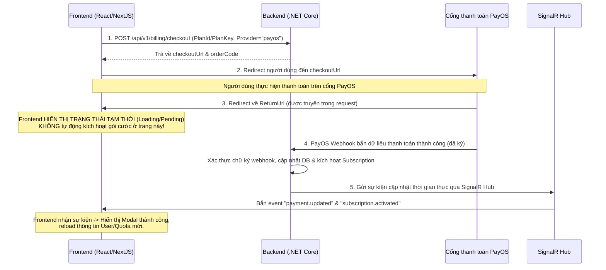

# Hướng dẫn tích hợp Frontend — Phase 18: Cổng thanh toán PayOS & SignalR Realtime

Tài liệu này hướng dẫn cách tích hợp luồng thanh toán qua **PayOS** và lắng nghe sự kiện cập nhật trạng thái thanh toán thời gian thực qua **SignalR** trong ứng dụng INTER-VIET.

---

## 1. Luồng Thanh Toán Tổng Quan



---

## 2. Chi tiết Tích hợp API

### Bước 1: Khởi tạo phiên thanh toán (Checkout Session)

Frontend gọi API sau khi người dùng click nút nâng cấp/thanh toán gói dịch vụ:

*   **API Path:** `POST /api/v1/billing/checkout`
*   **Headers:** `Authorization: Bearer <token>`
*   **Request Body (JSON):**
    ```json
    {
      "planId": "3fa85f64-5717-4562-b3fc-2c963f66afa6",
      "planKey": "premium_monthly",
      "provider": "payos",
      "returnUrl": "http://localhost:3000/subscription/success",
      "cancelUrl": "http://localhost:3000/subscription/cancel"
    }
    ```
*   **Response Body (JSON - HTTP 200):**
    ```json
    {
      "checkoutSessionId": "a90bb353-81b4-42b7-849f-b98a12e3e5b6",
      "paymentId": "a90bb353-81b4-42b7-849f-b98a12e3e5b6",
      "checkoutUrl": "https://pay.payos.vn/web/3fa85f64-5717-4562-b3fc-2c963f66afa6",
      "status": "pending",
      "expiresAt": "2026-05-28T14:10:00Z",
      "expiredAt": "2026-05-28T14:10:00Z",
      "provider": "payos",
      "planKey": "premium_monthly",
      "amount": 200000,
      "currencyCode": "VND",
      "paymentInstructionsUrl": "/api/v1/billing/checkout-sessions/a90bb353-81b4-42b7-849f-b98a12e3e5b6/payment-instructions"
    }
    ```

### Bước 2: Điều hướng người dùng (Redirect)

Frontend lấy giá trị `checkoutUrl` từ response và điều hướng trình duyệt:
```javascript
window.location.href = response.data.checkoutUrl;
```

---

## 3. Quy tắc bắt buộc tại Trang Return URL

Khi người dùng hoàn tất thanh toán trên PayOS, cổng thanh toán sẽ tự động redirect trình duyệt về trang `returnUrl` (Ví dụ: `http://localhost:3000/subscription/success?code=00&id=...`).

> [!WARNING]
> **Quy tắc bảo mật quan trọng:**
> Trang Success của Frontend **KHÔNG ĐƯỢC PHÉP** gọi API backend để kích hoạt gói cước. Mọi hành động kích hoạt gói cước ở client thông qua URL callback đều có thể bị giả mạo.
>
> 1. Frontend chỉ nên hiển thị màn hình thông báo dạng: **"Đang xử lý giao dịch thanh toán..."** hoặc **"Đang chờ cổng thanh toán xác nhận..."** kèm biểu tượng loading.
> 2. Backend sẽ chỉ kích hoạt gói cước khi nhận được **Webhook chính thức** từ PayOS (hoặc khi đối soát trực tiếp từ API PayOS).
> 3. Frontend sẽ cập nhật giao diện sau khi nhận được sự kiện realtime qua SignalR (xem Phần 4 bên dưới).

---

## 4. Lắng nghe Sự kiện Thời gian thực qua SignalR

Để mang lại trải nghiệm mượt mà, Frontend cần kết nối tới SignalR Hub và lắng nghe các sự kiện thanh toán.

### Kết nối Hub
*   **Hub URL Endpoint:** `/hubs/notifications` (Cần gửi kèm Bearer Token qua query string `access_token` khi khởi tạo kết nối SignalR).
*   **Cơ chế Nhóm:** Hub sẽ tự động thêm kết nối của user vào nhóm `user:<userId>` dựa trên token đã xác thực.

### Các Sự Kiện Cần Lắng Nghe

#### 1. Sự kiện `payment.updated`
Bắn xuống khi trạng thái thanh toán của phiên được cập nhật (Ví dụ: Succeeded, Failed).

*   **Payload structure:**
    ```json
    {
      "paymentId": "a90bb353-81b4-42b7-849f-b98a12e3e5b6",
      "orderCode": 17826372132,
      "status": "succeeded", // "succeeded", "failed"
      "provider": "payos",
      "subscriptionId": "8f67389a-4127-4632-bd92-4f3b8901aa92" // null nếu không kích hoạt subscription
    }
    ```

#### 2. Sự kiện `subscription.activated`
Bắn xuống ngay sau khi gói subscription của người dùng đã được kích hoạt/gia hạn thành công trên hệ thống.

*   **Payload structure:**
    ```json
    {
      "paymentId": "a90bb353-81b4-42b7-849f-b98a12e3e5b6",
      "orderCode": 17826372132,
      "status": "succeeded",
      "provider": "payos",
      "subscriptionId": "8f67389a-4127-4632-bd92-4f3b8901aa92"
    }
    ```

### Code mẫu tích hợp (React/Typescript)

```typescript
import * as signalR from "@microsoft/signalr";
import { useEffect, useState } from "react";

export function usePaymentListener(token: string, onPaymentSuccess: (data: any) => void) {
  const [connection, setConnection] = useState<signalR.HubConnection | null>(null);

  useEffect(() => {
    // 1. Khởi tạo kết nối SignalR Hub
    const newConnection = new signalR.HubConnectionBuilder()
      .withUrl("http://localhost:5000/hubs/notifications", {
        accessTokenFactory: () => token,
        skipNegotiation: true,
        transport: signalR.HttpTransportType.WebSockets
      })
      .withAutomaticReconnect()
      .build();

    setConnection(newConnection);
  }, [token]);

  useEffect(() => {
    if (!connection) return;

    // 2. Bắt đầu kết nối
    connection.start()
      .then(() => {
        console.log("Connected to Notifications SignalR Hub successfully!");

        // 3. Đăng ký lắng nghe sự kiện
        connection.on("payment.updated", (payload) => {
          console.log("Received payment.updated:", payload);
          if (payload.status === "succeeded") {
            // Hiển thị trạng thái thành công cho thanh toán chung
          } else if (payload.status === "failed") {
            // Hiển thị thông báo thất bại
          }
        });

        connection.on("subscription.activated", (payload) => {
          console.log("Received subscription.activated:", payload);
          // Gọi hàm callback xử lý giao diện (ví dụ: hiển thị Modal chúc mừng, reload user profile)
          onPaymentSuccess(payload);
        });
      })
      .catch(err => console.error("Error establishing SignalR connection:", err));

    return () => {
      connection.off("payment.updated");
      connection.off("subscription.activated");
      connection.stop();
    };
  }, [connection, onPaymentSuccess]);
}
```

---

## 5. API Tra cứu trạng thái giao dịch (Fallback/Polling)

Nếu người dùng vô tình đóng trình duyệt trước khi SignalR kịp nhận sự kiện, Frontend có thể sử dụng endpoint sau để chủ động kiểm tra trạng thái thanh toán khi quay lại giao diện:

*   **API Path:** `GET /api/v1/billing/payments/{id}`
    > [!NOTE]
    > Giá trị `{id}` ở đây hỗ trợ cả **`paymentId`** hoặc **`checkoutSessionId`** (hai giá trị này bằng nhau và được trả về từ response của API `POST /api/v1/billing/checkout` trước đó).
*   **Headers:** `Authorization: Bearer <token>`
*   **Response Body (JSON - HTTP 200):**
    ```json
    {
      "id": "a90bb353-81b4-42b7-849f-b98a12e3e5b6",
      "provider": "payos",
      "planKey": "premium_monthly",
      "checkoutSessionId": "a90bb353-81b4-42b7-849f-b98a12e3e5b6",
      "purpose": "subscription_plan",
      "description": "Nạp gói premium_monthly",
      "amount": 200000.00,
      "currencyCode": "VND",
      "status": "succeeded",
      "paidAt": "2026-05-28T13:45:10Z",
      "failedAt": null
    }
    ```

---

## 6. Cấu hình môi trường & Domain (Staging/Production env vars)

Khi triển khai trên môi trường thật, cần lưu ý cấu hình chính xác các đường dẫn Webhook và Redirect URL dưới dạng biến môi trường:

```bash
# 1. Webhook URL nhận thông báo từ PayOS gửi đến Backend API
PayOS__WebhookUrl=https://api.interviet.vn/api/v1/billing/payos/webhook

# 2. Redirect URL khi thanh toán thành công/hủy chuyển hướng về Frontend
PaymentRedirect__ReturnUrl=https://app.interviet.vn/payment/success
PaymentRedirect__CancelUrl=https://app.interviet.vn/payment/cancel
```
