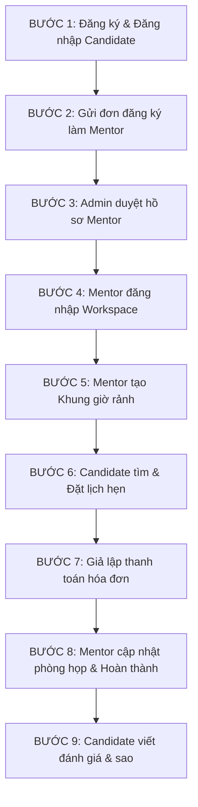

# 🚀 MENTOR END-TO-END FLOW TESTING GUIDE

Tài liệu này hướng dẫn chi tiết từng bước (Step-by-Step) để test **toàn bộ vòng đời (End-to-End Flow)** của tính năng Mentor trên hệ thống **INTER-VIET**, đi kèm các mẫu JSON Request và URL API chính xác nhất.

---

## 🗺️ TỔNG QUAN LUỒNG KỊCH BẢN TEST (E2E SCENARIO)

Kịch bản test gồm **9 bước liên kết tuần tự** để giả lập các tương tác thực tế giữa **Ứng viên (Candidate)**, **Quản trị viên (Admin)** và **Chuyên gia (Mentor)**:



---

## 🔐 0. THÔNG TIN CHUNG VỀ AUTHENTICATION
Tất cả các API yêu cầu đăng nhập cần truyền **Bearer Token** trong Header của Request:
```http
Authorization: Bearer <nhập_access_token_tại_đây>
```

---

## 📂 CHI TIẾT 9 BƯỚC THỰC HIỆN & JSON PAYLOAD

### 👤 BƯỚC 1: ĐĂNG KÝ & ĐĂNG NHẬP TÀI KHOẢN CANDIDATE
*Đăng ký một tài khoản ứng viên mới để bắt đầu luồng test.*

#### 1.1 Đăng ký tài khoản (Candidate)
* **API Route:** `POST /api/v1/auth/register`
* **Request Body (JSON):**
```json
{
  "fullName": "Gia Huy Test Candidate",
  "email": "giahuy.candidate@gmail.com",
  "password": "Password123@"
}
```
* **Response (200 OK):**
```json
{
  "message": "Đăng ký tài khoản thành công. Vui lòng kiểm tra email để xác thực tài khoản."
}
```

#### 1.2 Đăng nhập tài khoản (Candidate)
* **API Route:** `POST /api/v1/auth/login`
* **Request Body (JSON):**
```json
{
  "email": "giahuy.candidate@gmail.com",
  "password": "Password123@"
}
```
* **Response (200 OK):**
```json
{
  "accessToken": "eyJhbGciOiJIUzI1NiIsIn...",
  "refreshToken": "...",
  "expiresInSeconds": 7200,
  "user": {
    "id": "11111111-1111-1111-1111-111111111111",
    "email": "giahuy.candidate@gmail.com",
    "fullName": "Gia Huy Test Candidate",
    "role": "candidate"
  }
}
```
> [!IMPORTANT]
> Lưu lại `accessToken` của Candidate và `id` của Candidate để sử dụng cho các bước tiếp theo.

---

### 📝 BƯỚC 2: CANDIDATE GỬI ĐƠN ĐĂNG KÝ LÀM MENTOR
*Sử dụng token của Candidate vừa lấy được để gửi đơn đăng ký chuyên gia lên hệ thống.*

* **API Route:** `POST /api/v1/mentors/register`
* **Headers:** `Authorization: Bearer <Token_Candidate>`
* **Request Body (JSON):**
```json
{
  "fullName": "Gia Huy Mentor Professional",
  "headline": "Principal Backend Architect | Microsoft MVP",
  "bio": "Hơn 8 năm thiết kế hệ thống phân tán hiệu năng cao bằng .NET, Java, Postgres. Mong muốn cố vấn và định hướng lộ trình nghề nghiệp cho các bạn trẻ.",
  "yearsOfExperience": 8.0,
  "expertise": ["Backend Development", "System Architecture", "PostgreSQL"],
  "industries": ["Fintech", "Enterprise Software"],
  "languages": ["Tiếng Việt", "English"],
  "specialtyIds": [
    "e1f2g3h4-i5j6-4k7l-8m9n-0o1p2q3r4s5t" 
  ],
  "meetingUrl": "https://meet.google.com/giahuy-mentor-room"
}
```
* **Response (201 Created):**
```json
{
  "message": "Đăng ký thành công. Vui lòng chờ quản trị viên phê duyệt hồ sơ của bạn.",
  "mentorProfileId": "22222222-2222-2222-2222-222222222222"
}
```
> [!NOTE]
> *Giá trị `specialtyIds` bạn có thể lấy bằng cách gọi API Public Danh mục chuyên môn: `GET /api/v1/mentor/specialties` (API này cho phép Guest truy cập).*

---

### 👑 BƯỚC 3: ADMIN ĐĂNG NHẬP & PHÊ DUYỆT HỒ SƠ MENTOR
*Hồ sơ khi mới đăng ký sẽ ở trạng thái `status: inactive` và `isVerified: false`. Admin phải duyệt hồ sơ này.*

#### 3.1 Admin Đăng nhập
* **API Route:** `POST /api/v1/auth/login`
* **Request Body (JSON):**
```json
{
  "email": "admin@interviet.vn",
  "password": "Password123@"
}
```
* **Response (200 OK):** *(Trả về Token của Admin).*

#### 3.2 Admin duyệt hồ sơ
* **API Route:** `POST /api/v1/mentor/admin/mentors/{mentorProfileId}/verify?verify=true`
* **Headers:** `Authorization: Bearer <Token_Admin>`
* **URL Params:** `verify=true` (để duyệt)
* **Response (200 OK):**
```json
{
  "message": "Phê duyệt hồ sơ chuyên gia thành công.",
  "mentorProfileId": "22222222-2222-2222-2222-222222222222",
  "isVerified": true
}
```

#### 3.3 Admin Kích hoạt hoạt động của Mentor
* **API Route:** `POST /api/v1/mentor/admin/mentors/{mentorProfileId}/status?status=active`
* **Headers:** `Authorization: Bearer <Token_Admin>`
* **URL Params:** `status=active`
* **Response (200 OK):**
```json
{
  "message": "Cập nhật trạng thái hoạt động thành công.",
  "status": "active"
}
```

---

### 💼 BƯỚC 4: MENTOR ĐĂNG NHẬP VÀO WORKSPACE RIÊNG
*Sau khi đơn đăng ký được duyệt, quyền (Role) của tài khoản Candidate ban đầu sẽ tự động được nâng cấp lên thành `mentor`. Đăng nhập lại để nhận Token mới có chứa quyền Mentor.*

* **API Route:** `POST /api/v1/auth/login`
* **Request Body (JSON):**
```json
{
  "email": "giahuy.candidate@gmail.com",
  "password": "Password123@"
}
```
* **Response (200 OK):**
```json
{
  "accessToken": "eyJhbGciOiJIUzI1NiIsM...", // Đây là Token có quyền MENTOR
  "user": {
    "id": "11111111-1111-1111-1111-111111111111",
    "email": "giahuy.candidate@gmail.com",
    "fullName": "Gia Huy Mentor Professional",
    "role": "mentor" // Quyền đã được nâng lên Mentor thành công!
  }
}
```
> [!IMPORTANT]
> Lưu lại `accessToken` của Mentor này để dùng ở Bước 5, 8.

---

### 📅 BƯỚC 5: MENTOR CÀI ĐẶT LỊCH RẢNH (AVAILABILITY SLOTS)
*Mentor tự tạo các khung thời gian rảnh của mình để ứng viên có thể đặt lịch.*

* **API Route:** `PUT /api/v1/mentor/availability`
* **Headers:** `Authorization: Bearer <Token_Mentor>`
* **Request Body (JSON):**
```json
{
  "slots": [
    {
      "startsAt": "2026-06-01T08:00:00Z",
      "endsAt": "2026-06-01T09:00:00Z",
      "priceAmount": 200000.0,
      "currencyCode": "VND"
    },
    {
      "startsAt": "2026-06-01T09:30:00Z",
      "endsAt": "2026-06-01T10:30:00Z",
      "priceAmount": 200000.0,
      "currencyCode": "VND"
    }
  ]
}
```
* **Response (200 OK):**
```json
{
  "clearedCount": 0,
  "addedCount": 2
}
```

---

### 🎯 BƯỚC 6: CANDIDATE HẸN LỊCH VỚI MENTOR (BOOK MENTOR)
*Đăng ký hoặc sử dụng một tài khoản Candidate khác (hoặc chính tài khoản Candidate ban đầu trước khi làm Mentor) để book lịch rảnh vừa tạo.*

#### 6.1 Lấy danh sách khung giờ rảnh công khai của Mentor
* **API Route:** `GET /api/v1/public/mentors/22222222-2222-2222-2222-222222222222`
* **Response (200 OK):**
```json
{
  "id": "22222222-2222-2222-2222-222222222222",
  "fullName": "Gia Huy Mentor Professional",
  "availabilitySlots": [
    {
      "id": "33333333-3333-3333-3333-333333333333", // slotId thứ nhất
      "startsAt": "2026-06-01T08:00:00Z",
      "endsAt": "2026-06-01T09:00:00Z",
      "status": "available",
      "priceAmount": 200000.0,
      "currencyCode": "VND"
    }
  ]
}
```

#### 6.2 Candidate thực hiện Đặt lịch (Book Mentor)
* **API Route:** `POST /api/v1/mentor-bookings`
* **Headers:** `Authorization: Bearer <Token_Candidate>`
* **Request Body (JSON):**
```json
{
  "slotId": "33333333-3333-3333-3333-333333333333",
  "serviceType": "cv_review",
  "candidateNotes": "Cố vấn giúp em cấu trúc lại phần kinh nghiệm dự án .NET trong CV."
}
```
* **Response (200 OK):**
```json
{
  "bookingId": "44444444-4444-4444-4444-444444444444",
  "status": "pending_payment",
  "amount": 200000.0,
  "currencyCode": "VND",
  "checkoutSessionId": "55555555-5555-5555-5555-555555555555",
  "checkoutUrl": "https://pay.payos.vn/web/fbaac18082b943b2...", // Link để ứng viên thanh toán thật qua PayOS
  "paymentInstructionsUrl": "/api/v1/billing/checkout-sessions/55555555-5555-5555-5555-555555555555/payment-instructions"
}
```
> [!IMPORTANT]
> Lưu lại `bookingId` và `checkoutSessionId` vừa được tạo ra.

---

### 💳 BƯỚC 7: GIẢ LẬP THANH TOÁN THÀNH CÔNG (TEST LOCAL HOẶC PRODUCTION)
*Vì khi chạy test, ta không muốn thanh toán tiền thật qua cổng PayOS, ta sẽ gọi API giả lập thanh toán của Hệ thống để đẩy trạng thái Booking từ `pending_payment` sang `confirmed` (Đã thanh toán thành công).*

#### Giả lập thanh toán thành công
* **API Route:** `POST /api/v1/billing/checkout-sessions/{checkoutSessionId}/simulate-success`
* **Headers:** `Authorization: Bearer <Token_Candidate>`
* **Response (200 OK):**
```json
{
  "message": "Giả lập thanh toán thành công. Giao dịch đã được ghi nhận.",
  "paymentId": "66666666-6666-6666-6666-666666666666",
  "status": "succeeded"
}
```
> [!TIP]
> *Sau khi thanh toán thành công, hệ thống tự động cập nhật trạng thái Booking thành `confirmed` và gửi email hóa đơn chi tiết cho ứng viên chạy ngầm.*

---

### 🤝 BƯỚC 8: MENTOR XÁC NHẬN PHÒNG HỌP & HOÀN THÀNH CUỘC HẸN
*Khi lịch hẹn đã thành công, Mentor sẽ xác nhận phòng họp và thực hiện buổi gặp mặt.*

#### 8.1 Mentor cập nhật Meeting URL (nếu phòng họp thay đổi)
* **API Route:** `PATCH /api/v1/mentor/bookings/{bookingId}/meeting-url`
* **Headers:** `Authorization: Bearer <Token_Mentor>`
* **Request Body (JSON):**
```json
{
  "meetingUrl": "https://meet.google.com/giahuy-private-room-111"
}
```
* **Response (200 OK):**
```json
{
  "message": "Cập nhật link phòng họp thành công.",
  "meetingUrl": "https://meet.google.com/giahuy-private-room-111"
}
```

#### 8.2 Mentor Hoàn thành buổi hẹn (Sau khi gặp mặt xong)
* **API Route:** `POST /api/v1/mentor/bookings/{bookingId}/status`
* **Headers:** `Authorization: Bearer <Token_Mentor>`
* **Request Body (JSON):**
```json
{
  "status": "completed"
}
```
* **Response (200 OK):**
```json
{
  "message": "Cập nhật trạng thái lịch hẹn thành công.",
  "previousStatus": "confirmed",
  "currentStatus": "completed"
}
```

---

### ⭐ BƯỚC 9: CANDIDATE VIẾT ĐÁNH GIÁ & ĐÁNH GIÁ SAO (REVIEW MENTOR)
*Khi buổi hẹn đổi trạng thái sang `completed`, Candidate có quyền gửi nhận xét và chấm điểm đánh giá sao cho Mentor.*

* **API Route:** `POST /api/v1/mentor-bookings/{bookingId}/review`
* **Headers:** `Authorization: Bearer <Token_Candidate>`
* **Request Body (JSON):**
```json
{
  "rating": 5,
  "comment": "Anh Huy giải thích rất dễ hiểu, đưa ra lộ trình chi tiết giúp em cải thiện kỹ năng C# rất nhiều!"
}
```
* **Response (200 OK):**
```json
{
  "id": "77777777-7777-7777-7777-777777777777",
  "bookingId": "44444444-4444-4444-4444-444444444444",
  "rating": 5,
  "comment": "Anh Huy giải thích rất dễ hiểu, đưa ra lộ trình chi tiết giúp em cải thiện kỹ năng C# rất nhiều!",
  "createdAt": "2026-06-01T11:00:00Z"
}
```
> [!TIP]
> *Lúc này, điểm `ratingAverage` của Mentor trên trang Landing Page sẽ tự động được tính toán lại theo cơ chế tích lũy thời gian thực.*

---

## 🛠️ PHƯƠNG PHÁP KIỂM TRA BẰNG POSTMAN / THUNDER CLIENT
1. Tạo một thư mục Collection mới tên là `INTER-VIET Mentor Flow`.
2. Tạo lần lượt 9 Request tương ứng với 9 bước trên.
3. Sử dụng tính năng Variables của Postman để lưu trữ tự động `candidateToken`, `mentorToken`, `adminToken` sau mỗi lần đăng nhập để kế thừa cho các request tiếp theo một cách mượt mà nhất.
